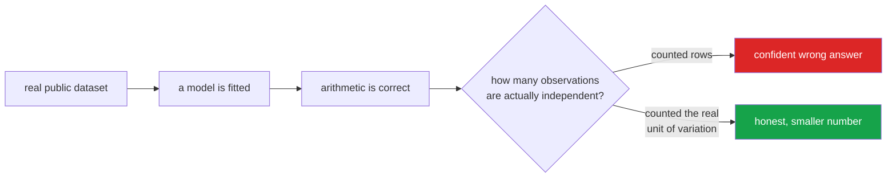

<h1 align="center">machine-learning</h1>
<p align="center"><i>Twenty projects, each built around the mistake that makes its answer wrong</i></p>

<p align="center">
  <a href="#the-through-line">The through-line</a> &middot;
  <a href="#the-twenty">The twenty</a> &middot;
  <a href="#data">Data</a> &middot;
  <a href="#on-charts">On charts</a> &middot;
  <a href="#where-i-was-wrong">Where I was wrong</a> &middot;
  <a href="#running-it">Running it</a>
</p>

<p align="center">
  <a href="https://github.com/hammas159/machine-learning/actions/workflows/ci.yml"></a>
  <a href="https://www.python.org"></a>
  
  
  
  
  <a href="LICENSE"></a>
</p>

---

**Twenty machine-learning projects on public data. Each one is built around the mistake that
makes its answer wrong.**

Every dataset is real, public, and downloadable without an account. Every figure states its
source and its sample size. Nothing here is a tutorial.

---

## The through-line

Most of these projects fail in the same way, and it is not a modelling failure:

> **The number was computed correctly and the question was miscounted.**

| | Project | What was counted | What was actually independent |
|---|---|---|---|
| 01 | Backtest overfitting | one strategy's Sharpe | 846 strategies searched |
| 05 | Target leakage | 45,211 calls | 45,211 calls *and* a column from the future |
| 08 | Overlapping windows | 1,593 monthly windows | 13 decades |
| 03 | Imbalanced failure | 99% accuracy | a 3.4% base rate |
| 10 | Price elasticity | 63,011 product-months | 3,739 different products |
| 17 | Spurious regression | a t-statistic of 18.8 | two unrelated random walks |
| 18 | Target encoding | a feature | that feature's own label |
| 20 | Association rules | 140,810 "rules" | 4.3% that chance couldn't produce |

In every case the arithmetic downstream was perfect.

### The same failure, drawn



The arithmetic downstream is perfect in every case. The error is upstream, in what was
treated as an independent observation - and it is invisible to any amount of model tuning.


## The twenty


### Quant and trading

| # | Project | Headline finding | Status |
|---:|---|---|:--:|
| [01](projects/01-backtest-overfitting/) | [**Backtest overfitting**](projects/01-backtest-overfitting/) ⭐ | 846 trading rules on the real S&P 500 found a winner at Sharpe 0.620. The same 846 rules on **shuffled** S&P 500 found a better one at 0.695. Deflated Sharpe Ratio says the probability the edge is real is **23.5%**. | ✅ |
| [06](projects/06-volatility-regimes/) | [**Volatility regimes**](projects/06-volatility-regimes/) | 35 years of VIX. Set out to prove hindsight bias in regime labelling; **both hypotheses failed** — real-time labelling agrees with hindsight 89.5% of the time. Reported as measured. | ✅ |
| [08](projects/08-overlapping-windows/) | [**Overlapping windows**](projects/08-overlapping-windows/) ⭐ | Does valuation predict returns? Naive OLS: **t = −13.75**. Disjoint windows: **t = −1.15**. Same data, same slope. The inflation factor is 12.0; `sqrt(120) = 11.0`. | ✅ |
| [17](projects/17-time-series/) | [**Time series**](projects/17-time-series/) ⭐ | 155 years of Shiller data. Two independent random walks regressed on each other come back significant **93.7% of the time**, median \|t\| = 18.8. And on the level nothing beats predicting the last value — but difference the series and the ranking inverts completely. | ✅ |


### Industry and operations

| # | Project | Headline finding | Status |
|---:|---|---|:--:|
| [03](projects/03-imbalanced-maintenance/) | [**Imbalanced failure prediction**](projects/03-imbalanced-maintenance/) | 10,000 machine cycles, 3.4% failures. A model that predicts "no failure" scores **97.97% accuracy**. ROC-AUC calls two models close; average precision says one is twice as good. | ✅ |
| [09](projects/09-forecast-backtest/) | [**Forecast backtesting**](projects/09-forecast-backtest/) | 604 trading days, 60 rolling folds. A **flat 28-day mean beats both models that know about the weekly cycle** — at a 7-day horizon the weekday shape averages away. | ✅ |
| [16](projects/16-anomaly/) | [**Anomaly detection**](projects/16-anomaly/) | Three detectors, no labels. Mahalanobis — invented in 1936, no hyperparameters — wins at **12.4× lift**. But 81% of *power* failures are caught and **4% of heat-dissipation failures**: "anomalous" and "the failure I care about" are different sets. | ✅ |
| [19](projects/19-regularisation/) | [**Regularisation**](projects/19-regularisation/) ⭐ | Ridge, lasso, elastic net and no penalty score within **0.0023 AUC** of each other while keeping 14, 7, 10 and 14 features. `temp_difference` survives 100% of bootstraps; `temp_ratio`, correlated with it at **0.999**, survives 7.5%. | ✅ |


### Marketing and customers

| # | Project | Headline finding | Status |
|---:|---|---|:--:|
| [04](projects/04-customer-value/) | [**Customer value**](projects/04-customer-value/) | 1,055,823 invoice lines. Mean value £2,844, median £855 — **the mean sits at the 80th percentile**. The top 1% of customers produce 31% of revenue. | ✅ |
| [05](projects/05-leakage/) | [**Target leakage**](projects/05-leakage/) ⭐ | The published benchmark for this dataset is 0.93 ROC-AUC. **Fix two things and it is 0.63.** | ✅ |
| [07](projects/07-segmentation-stability/) | [**Segmentation stability**](projects/07-segmentation-stability/) | Shuffle every feature independently — destroying all structure, keeping all distributions — and k-means still scores a silhouette of **0.25**. Real data scores 0.33. | ✅ |
| [10](projects/10-price-elasticity/) | [**Price elasticity**](projects/10-price-elasticity/) | Pooled: **−0.77, inelastic, raise prices.** Within-product: **−1.97, elastic, raising prices costs you money.** Same ledger, opposite instruction. | ✅ |
| [14](projects/14-recommenders/) | [**Recommenders**](projects/14-recommenders/) | Item-item CF, ALS and the baseline nobody runs: recommend the bestsellers to everybody. Coverage and novelty are reported next to accuracy, because a recommender that shows everyone the same ten products can score respectably and sell nothing new. | ✅ |
| [18](projects/18-encoding-leakage/) | [**Target encoding**](projects/18-encoding-leakage/) ⭐ | A column of **random integers**, target-encoded the way most tutorials show, lifts test AUC from 0.567 to **0.652**. It contains no information. And the broken encoder beats the correct one on the test set, so the standard diagnostic points the wrong way. | ✅ |
| [20](projects/20-market-basket/) | [**Market basket**](projects/20-market-basket/) ⭐ | 140,810 association rules; 79% have lift > 1, the usual "associated" threshold. **Reshuffle the products at random and chance still produces a lift of 3.1** — only 4.3% of the real rules clear that. Remove the support floor and the top-50 rules' survival rate into the next quarter falls from 80% to 32%. | ✅ |


### Risk, pricing and probability

| # | Project | Headline finding | Status |
|---:|---|---|:--:|
| [11](projects/11-insurance-pricing/) | [**Insurance pricing**](projects/11-insurance-pricing/) | 678,013 French motor policies. Poisson frequency × Gamma severity against a Tweedie, with `offset=log(Exposure)` — the line that turns a claim *count* model into a claim *rate* model. | ✅ |
| [12](projects/12-calibration/) | [**Calibration**](projects/12-calibration/) | Halve every predicted probability and ROC-AUC does not move by 10⁻¹². Every decision that depends on the probability changes. Platt vs isotonic, priced in money. | ✅ |
| [13](projects/13-survival/) | [**Survival analysis**](projects/13-survival/) | **A customer who has not churned yet is not a negative — she is censored.** Kaplan-Meier, log-rank and Cox implemented directly, because the censoring logic *is* the lesson. | ✅ |
| [15](projects/15-dimensionality/) | [**Dimensionality reduction**](projects/15-dimensionality/) | PCA, truncated SVD, NMF, t-SNE. Forget to scale and the first component reports which column was recorded in larger numbers. | ✅ |


### Sport

| # | Project | Headline finding | Status |
|---:|---|---|:--:|
| [02](projects/02-sports-calibration/) | [**Sports forecasting**](projects/02-sports-calibration/) | 3,420 Premier League matches against Pinnacle closing odds. Elo beats the base rate on every metric — and its value bets return **−3.38%**, worse than blindly backing favourites at −1.53%. | ✅ |


## Data

Nine public sources, all verified reachable on 2026-09-11, all cached after first fetch with
a SHA-256 recorded in `data/sources.json`.

| Source | Size | Licence |
|---|---|---|
| Daily closes, 5 tickers (`plotly/datasets`) | 2,306 days | MIT |
| CBOE VIX daily since 1990 | 9,269 days | public |
| Shiller S&P 500 monthly since 1871 | 1,868 months | public (Yale) |
| football-data.co.uk, EPL ×9 seasons | 3,420 matches | free w/ attribution |
| UCI AI4I 2020 predictive maintenance | 10,000 cycles | CC BY 4.0 |
| UCI Online Retail II | 1,055,823 lines | CC BY 4.0 |
| UCI Bank Marketing | 45,211 calls | CC BY 4.0 |
| freMTPL2freq (OpenML) | 678,013 policies | public / GPL-2 |
| freMTPL2sev (OpenML) | 26,639 claims | public / GPL-2 |

Four planned sources were **dropped rather than left in as aspiration**: Stooq and FRED are
behind JavaScript browser challenges, `files.grouplens.org` refused connections, and every
mirror of the Hillstrom uplift dataset was unreachable — so the uplift project was dropped
rather than faked on a randomised experiment that did not exist.
`uv run python shared/data.py --check` re-verifies every URL and reports which have gone.

## Running it

```bash
uv sync --all-groups
uv run pytest -q                                    # 176 tests, no downloads
uv run python projects/01-backtest-overfitting/run.py
```

Each project is self-contained: `run.py` fetches what it needs, prints its findings, writes
its figures and a `result.json`. No GPU, no API key, no notebook.

## Layout

```
shared/
  plotting.py     one visual language - Okabe-Ito palette, mandatory source captions
  validation.py   time splits, purged splits, group splits, cost thresholds, calibration
  data.py         public-dataset catalogue with provenance recording
projects/01..20/
  <module>.py     the method, with the trap documented
  run.py          fetch, compute, draw, report
  README.md       the finding, and what it cost to get right
  figures/        every chart, captioned
tests/            176 tests
```

## On charts

One style, defined once in `shared/plotting.py`, because twenty charts drawn twenty ways read
as twenty weekend projects.

- Okabe-Ito palette — roughly one man in twelve cannot separate matplotlib's default red
  from its green
- **Every figure carries a caption naming the source and the sample size.** A chart without
  `n` cannot be argued with
- Gridlines behind the data, horizontal only; no top or right spine
- Counts kept visible in binned plots, so a bin holding nine samples is not drawn at the
  same weight as one holding nine hundred

## Where I was wrong

Each project's README has a *Problems hit while building this* section. The ones worth
naming here:

- **01** — shipped a units bug. Fed an *annualised* Sharpe to a formula expecting the
  per-period one; the answer was wrong by 252× in the direction that makes an unproven
  strategy look proven. Caught because "15 days" was implausible, not because anything
  crashed.
- **11** — the Gini implementation ranked policies by predicted claim *count* instead of
  predicted *rate*. It scored the correct model at −0.03 and the broken one at +0.22, so it
  would have selected the wrong model and looked confident doing it.
- **20** — wrote the conclusion before the result. The top-lift rules were supposed to rest
  on four or five baskets; they rested on 296, because the support floor had already excluded
  every rule that would have proved the point. **The parameters, not the metric, were doing
  the work** — which is a better finding than the one I was aiming at.
- **19** — expected the lasso's feature selection to be unstable under bootstrapping. It
  mostly wasn't, and the consistency turns out to be the more alarming result.
- **18** — expected the training/test gap to expose the leak. The broken encoder has the
  *smaller* gap, because its leak crosses the split.
- **02** — oversold a trap and cut it back: removing the bookmaker's overround moves Brier
  by 0.0001, not the headline I'd assumed.
- **06, 07, 09, 10** — four predictions about what the data would show; three were wrong and
  the READMEs say so rather than quietly reframing the question.

## Keywords

machine learning &middot; statistics &middot; data leakage &middot; target leakage &middot;
backtest overfitting &middot; deflated Sharpe ratio &middot; multiple comparisons &middot;
spurious regression &middot; overlapping windows &middot; class imbalance &middot;
base rate fallacy &middot; price elasticity &middot; target encoding &middot;
association rules &middot; survivorship bias &middot; scikit-learn &middot; pandas &middot;
NumPy &middot; statsmodels &middot; reproducible research &middot; public datasets &middot;
UCI &middot; Shiller &middot; CBOE VIX &middot; applied statistics &middot; model validation


## License

MIT. Datasets retain their own licences, recorded per-source above and in
`data/sources.json`.
