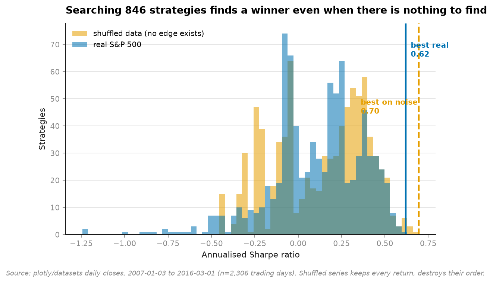
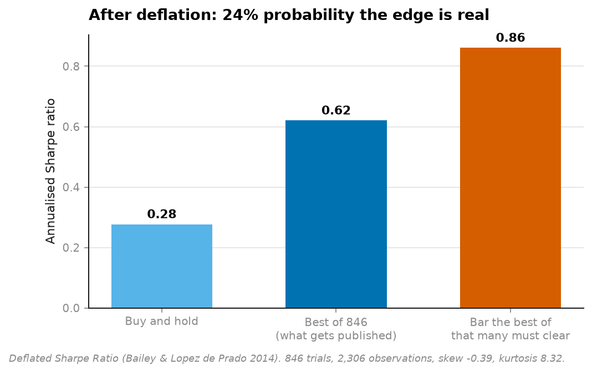
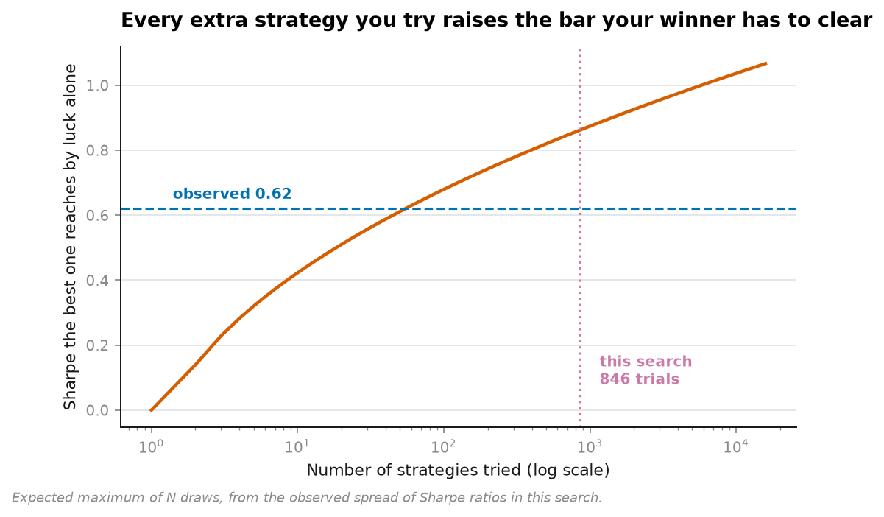

# 01 · Backtest overfitting (NumPy, pandas, Matplotlib, SciPy)

**Searching 846 trading rules on the S&P 500 found a winner. Searching the same 846 rules
on *shuffled* S&P 500 data found a better one.**

```
best of 846 on real S&P 500     crossover(14,180)   Sharpe 0.620
best of 846 on SHUFFLED data    crossover(16,60)    Sharpe 0.695   <- no edge can exist here
buy and hold                                        Sharpe 0.277

probability the winner's edge is real: 23.5%
```



The two histograms are the whole argument. Blue is 846 rules on real market history.
Orange is the identical 846 rules on the same returns in a random order — a series where
timing skill is *impossible by construction*. They sit on top of each other.

---

## The mistake this is about

Generate a thousand strategies, backtest them all, keep the one with the highest Sharpe.
Everyone does it. It feels like research.

**The problem: the maximum of N noisy estimates grows with N.** Try enough rules and one
will look excellent on any data at all, including data with nothing in it. The published
Sharpe then measures *how many things you tried*, not how good the strategy is.

The standard defences don't catch it:

| Defence | Why it fails here |
|---|---|
| "It's significant, t = 3.1" | A t-test asks whether *this* Sharpe beats zero. It has no idea 845 others were discarded |
| "I used out-of-sample data" | If you looked at out-of-sample results while choosing, they are in-sample |
| "The equity curve looks great" | It looks great *because* it was picked for looking great |

## The correction

**Deflated Sharpe Ratio** (Bailey & López de Prado, 2014) asks the sharper question:
*given N trials on T observations, with this skew and kurtosis, what is the probability
this Sharpe exceeds what the best of N pure-noise strategies would produce anyway?*

Three inputs a t-test ignores, all of which matter:

- **N**, the number of trials — the one everybody omits, because admitting it is embarrassing
- **skew** — negative skew inflates Sharpe, which is why selling options backtests beautifully until it doesn't
- **kurtosis** — fat tails make the Sharpe estimate itself noisier than it looks



The bar the winner had to clear was **0.86**. It reached **0.62**. The search alone
explains 139% of what was found.

## The control group that makes it arguable

Anyone can assert that a result is overfit. The shuffled-data search **demonstrates** it.

`shuffled_prices()` keeps every single daily return — same mean, same volatility, same
skew, same fat tails — and destroys only their *order*. No timing rule can have an edge on
that series. Whatever the search finds there is pure selection effect, made visible.

It found 0.695, and the real search found 0.620.

## How the bar moves



The bar rises like `sqrt(2 ln N)` — slowly, but relentlessly. Ten trials, a thousand and a
million are meaningfully different standards, and reporting *any* backtest without
reporting N is reporting half a number.

## Minimum track record length

The companion question, and the more useful one when someone shows you six months of
results:

```
Sharpe 0.62 needs 1,804 trading days (7.2 years) before it can be told apart from zero.
This dataset has 2,306 (9.2 years) — and that is BEFORE the search correction.
```

## Running it

```bash
uv run python projects/01-backtest-overfitting/run.py
```

Fetches the data on first run (151 KB), searches 846 rules twice, writes four figures and
`result.json`. About 20 seconds, no GPU, no API key.

**Data:** daily closes for MSFT / IBM / SBUX / AAPL / GSPC, 2007-01-03 to 2016-03-01,
2,306 trading days, from `plotly/datasets` (MIT). The S&P 500 index series is used here.

## What is deliberately honest about the setup

- **Signals are shifted one day.** A signal computed from today's close cannot be traded at
  today's close. Removing that `.shift(1)` roughly doubles every Sharpe in this file, and
  it is the single most common way a backtest lies.
- **Costs are charged.** 5 basis points on every position change. A costless backtest
  rewards exactly the strategies that cannot survive a broker.
- **The rules are ordinary on purpose.** Moving-average crossovers, momentum, mean
  reversion. The claim under test is not "these work" — it is "search hard enough over
  anything and one will *look* like it works."

## Problems hit while building this

**The minimum-track-record number came out as 15 days, and that was my bug.** Bailey and
López de Prado's formulas operate on the **per-period** Sharpe; I passed the annualised
one. The answer is then wrong by the annualisation factor squared — 252× — and it errs in
the direction that makes an unproven strategy look proven.

What makes it dangerous is that `15 days` doesn't look like a crash. It looks like an
answer. *Fixed* by splitting `sharpe_per_period()` from `sharpe()`, doing all the
mathematics in per-period units, and annualising once at the very end for display only.
The parameter is now named `per_period_sharpe` so the mistake is harder to repeat.

**The real search underperforming the noise search was not planned.** I expected the two
to come out close, which would have made the point. They came out *inverted*, which makes
it better — and it is worth being clear that this is one shuffle seed on one index over one
nine-year window, not a law of nature. The claim being made is "these are
indistinguishable", not "noise is better than markets."
