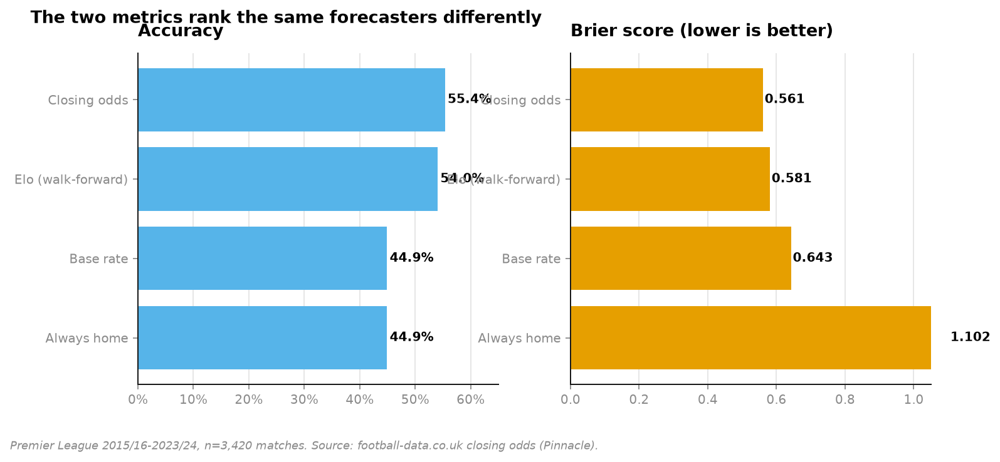
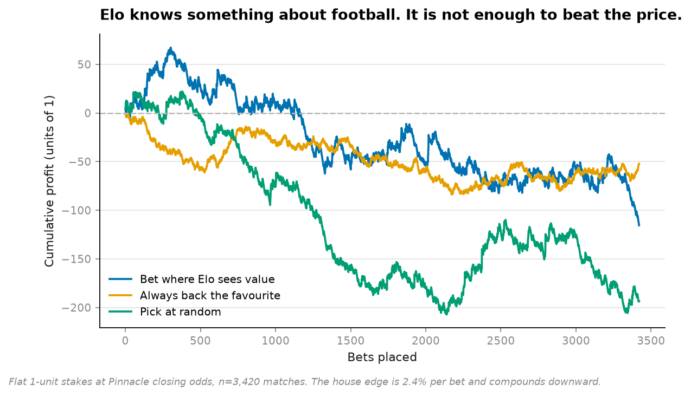
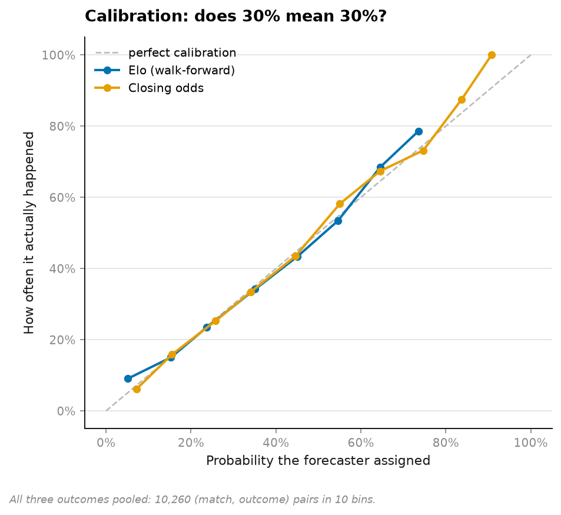
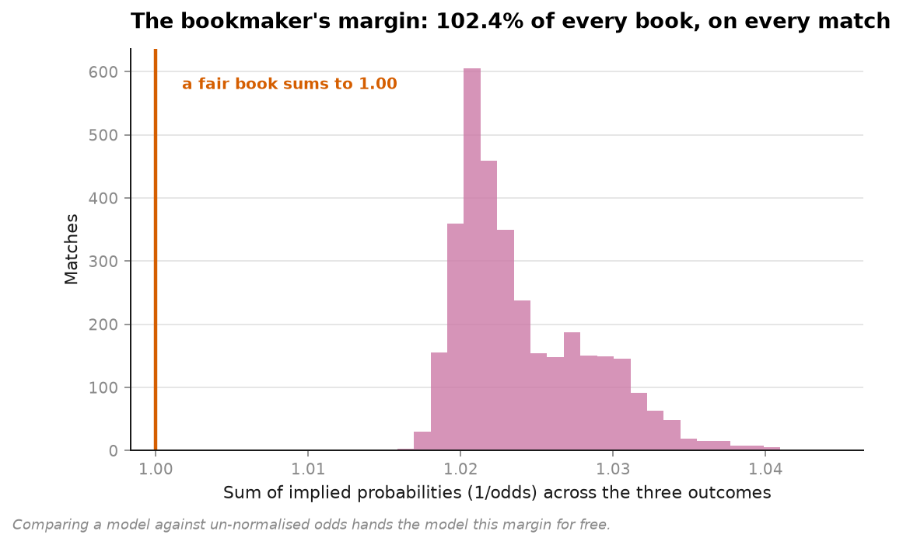
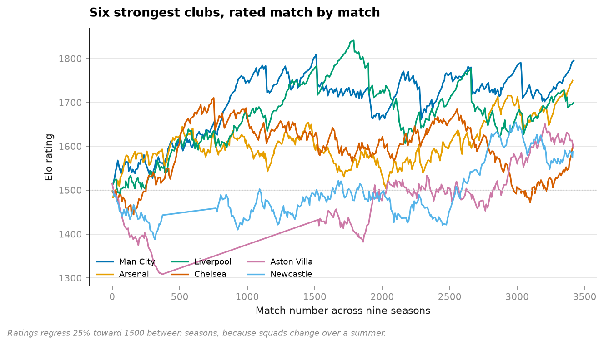

# 02 · Sports forecasting — accuracy is the wrong question (NumPy, pandas, Matplotlib)

**3,420 Premier League matches, nine seasons, against the closing odds.**

```
forecaster            accuracy    Brier    log loss
Always home              44.9%   1.1018     19.027
Base rate                44.9%   0.6428      1.063
Elo (walk-forward)       54.0%   0.5811      0.983
Closing odds             55.4%   0.5608      0.949
```

Two forecasters tie on accuracy at 44.9% — *always say home* and *say the base rate every
time*. One of them is a constant. Accuracy cannot tell them apart. **Brier separates them
by 0.46**, which is the gap between a forecast and a slogan.



---

## The finding that matters

Elo beats the base rate on every metric. It has learned something real about football.

Then you bet with it:

```
Bet where Elo sees value     3,420 bets   ROI  -3.38%
Always back the favourite    3,420 bets   ROI  -1.53%
Pick at random               3,420 bets   ROI  -5.66%
bookmaker margin per bet                        -2.40%
```



**Elo's value bets lose more than backing favourites blindly.** The model is genuinely
informative and still destroys money, because being better than *nothing* is not the bar —
being better than *the price* is, and the price already contains everything the market
knows plus a 2.4% toll.

This is the gap between "my model has good metrics" and "my model is useful", and it is
exactly the gap that a held-out test set cannot show you.

## Calibration: does 30% mean 30%?



Accuracy asks *was the top pick right*. Calibration asks *was the confidence honest*. A
forecaster who says 90% and is right 60% of the time is accurate and lying; only the second
question catches it.

All three outcomes pooled — 10,260 (match, outcome) pairs in ten bins, counts retained so a
bin holding nine samples doesn't get drawn at the same weight as one holding nine hundred.

## The overround



Raw `1/odds` across three outcomes sums to **1.024**, not 1.000. The excess is the
bookmaker's margin, and it must be removed before any comparison — otherwise the model's
probabilities (which sum to 1) are being judged against the bookmaker's (which sum to
1.024), handing the model a free 2.4%.

**Honest note on this:** removing it changes Brier by 0.0001. I expected it to matter more
and it did not — Brier is forgiving here. That is why the betting simulation exists: the
margin is invisible in the score and decisive in the bankroll, and only one of those is
real money.

## Elo, match by match



Ratings regress 25% toward 1500 between seasons, because the team that finished in May is
not the team that starts in August.

## What is deliberately honest about the setup

- **Walk-forward, always.** Every match is predicted using only what was known before
  kick-off; the rating updates *after* the prediction is recorded. Fitting Elo on a season
  and scoring that same season is the football version of shuffling a time series.
- **Closing odds, not opening.** Pinnacle closing prices are the sharpest published number
  in the sport — the hardest possible benchmark, chosen on purpose.
- **Margin of victory scales the update**, with diminishing returns: `log1p(margin)`. A 5-0
  win is more evidence than a 1-0, and the second goal says more than the fifth.

## Running it

```bash
uv run python projects/02-sports-calibration/run.py
```

Fetches nine season CSVs on first run (~1.6 MB total), writes five figures and
`result.json`. Under a minute.

**Data:** football-data.co.uk, English Premier League 2015/16 – 2023/24, 3,420 matches with
results and closing odds from Pinnacle. Free to use with attribution.

## Problems hit while building this

**The overround demonstration was oversold, and I cut it back.** I built this expecting
"forgetting to normalise the odds wrecks your comparison" to be the headline. It moves
Brier by 0.0001. Rather than dress that up, the README now says so and the real cost is
measured where it actually lands — in the P&L, where 2.4% per bet compounds into the whole
result.

**`Always home` scores log loss 19.0, which is a clipping artefact, not a number.** It
assigns probability 0 to draws and away wins, so `log(0)` is `-inf` and only the `1e-15`
floor keeps it finite. It is left in the table as a reminder that log loss is unbounded
below and one overconfident zero can dominate a whole season — which is precisely why it
punishes confident mistakes harder than Brier does.
