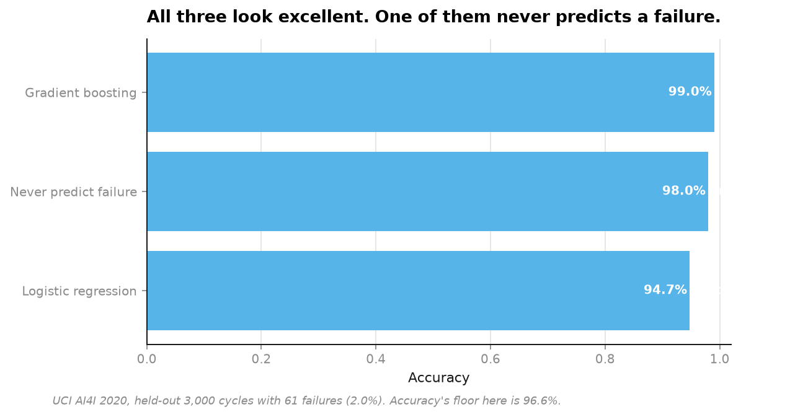
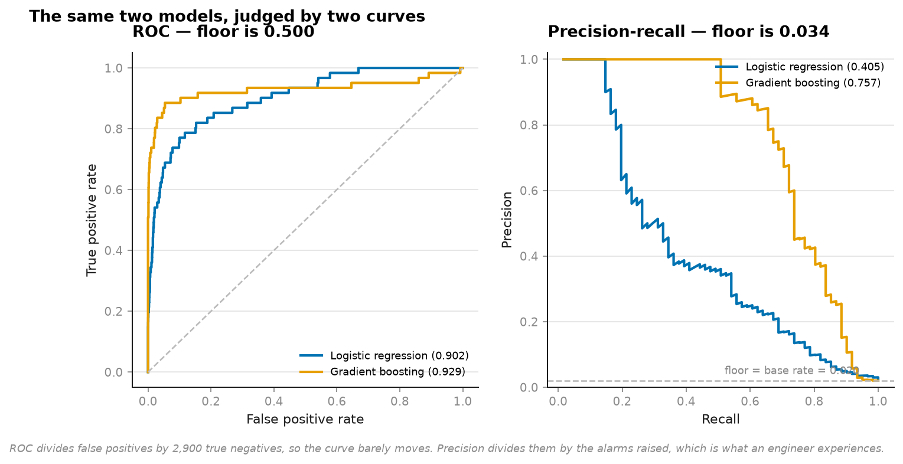
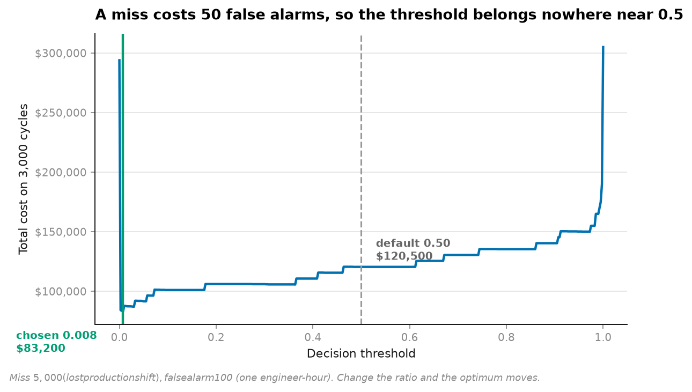
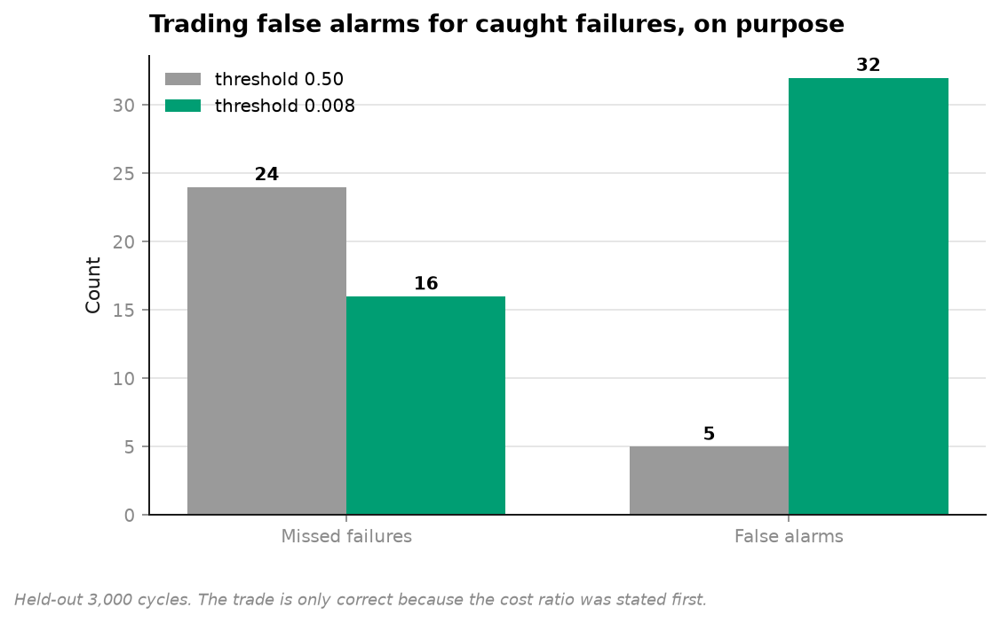

# 03 · Imbalanced failure prediction — 96.6% accuracy is the floor, not the ceiling (NumPy, pandas, Matplotlib, scikit-learn)

**10,000 real machine cycles, 339 failures (3.39%).**

```
model                   accuracy   recall   ROC-AUC   avg precision       cost
Never predict failure     97.97%      0%     0.500          0.020   $305,000
Logistic regression       94.73%     64%     0.902          0.405   $123,600
Gradient boosting         99.03%     61%     0.930          0.757   $120,500
```

The first row is a constant. It predicts "no failure" for all 3,000 held-out cycles,
catches nothing, and scores **97.97% accuracy** — higher than the logistic regression that
actually catches 64% of failures.



---

## Three defaults that fail here, in order of how much damage they do

### 1. Accuracy reports the base rate as skill

With a 3.4% positive rate, "always say no" is 96.6% correct. Any accuracy figure below
that is worse than a constant, and any figure just above it is indistinguishable from one.
Accuracy has no floor at chance — its floor is the majority class.

### 2. ROC-AUC flatters under imbalance



The same two models, side by side:

| | ROC-AUC | Average precision |
|---|---|---|
| Logistic regression | 0.902 | **0.405** |
| Gradient boosting | 0.930 | **0.757** |

**ROC says they are close. Precision-recall says one is nearly twice as good.**

The reason is in the denominator. The false-positive rate divides false alarms by 2,939
true negatives, so a hundred extra false alarms moves it by three percentage points and
the curve hardly notices. Precision divides those same false alarms by the number of
alarms *raised* — which is what a maintenance engineer actually experiences at 6am.

And the floors differ: ROC's floor is 0.500 regardless of imbalance. Average precision's
floor is the base rate, 0.034 — so 0.757 is a twenty-two-fold improvement over nothing,
a statement ROC cannot make.

### 3. Threshold 0.5 asserts both mistakes cost the same

They don't. Stated at the top of `run.py`, in money, before any model is fitted:

```python
COST_MISS = 5000.0  # an unplanned stoppage: a lost production shift
COST_ALARM = 100.0  # an unnecessary inspection: an engineer, an hour
```

A 50:1 ratio. The threshold that follows is **0.0075**, not 0.5.



```
threshold 0.500 (default)   24 missed   5 false alarms   $120,500
threshold 0.008 (chosen)    16 missed  32 false alarms    $83,200

saves $37,300 on 3,000 cycles — 31% of the cost
```



Eight more failures caught for twenty-seven more inspections. That trade is only
*correct* because the ratio was stated first — with a different cost structure the
optimum moves, and the point is that somebody has to decide, not that 0.0075 is magic.

Note what happens to the headline metrics: accuracy **falls** from 99.03% to 98.40% and
precision falls from 0.881 to 0.584. Optimising cost made both look worse. That is the
correct outcome and the reason to report cost.

## A quirk in the labels, found while loading

```
rows with a failure mode flagged but 'Machine failure' = 0 : 18
rows labelled failed with no mode flagged                 : 9
of those 18, random failures (RNF) = 18
```

`Machine failure` is documented as the OR of five modes (TWF/HDF/PWF/OSF/RNF), and it
isn't quite. All 18 disagreements are `RNF` — random failures, which the dataset's authors
deliberately excluded from the headline label. The nine in the other direction are
undocumented.

Left in, reported, and not silently patched: 27 rows out of 10,000 will not change a
conclusion, but a pipeline that quietly reconciles its own labels is a pipeline nobody can
audit.

## What is deliberately honest about the setup

- **Split by position, not at random.** These are sequential cycles of a wearing tool. A
  shuffled split lets the model see later points on the same wear curve it is meant to
  predict — the same leak as shuffling any time series.
- **Physics given, not rediscovered.** `power = torque × angular velocity` is a known
  relationship between two existing columns. Handing it over is honest feature engineering;
  making a tree infer it from scratch is a worse model pretending to be a purer one.
- **Quality grade is ordinal.** L/M/H is a casting grade, so it maps to 0/1/2 rather than
  three unordered dummies.

## Running it

```bash
uv run python projects/03-imbalanced-maintenance/run.py
```

Fetches 522 KB on first run, writes four figures and `result.json`. Around 10 seconds.

**Data:** UCI AI4I 2020 Predictive Maintenance, 10,000 cycles, CC BY 4.0.

## Problems hit while building this

**The best model by cost is not the best model by any headline metric.** Gradient boosting
at the chosen threshold has lower accuracy *and* lower precision than at 0.5, and it is
the version worth shipping. Every metric in the table moved the wrong way while the thing
being optimised improved by 31%, which is the clearest possible argument for deciding what
you are optimising *before* you look at a leaderboard.

**`Never predict failure` has an average precision of 0.020, below the 0.034 base rate.**
It scores all 3,000 cycles identically at zero, so the ranking is arbitrary and the
integration picks up whatever order the array happened to be in. It is a degenerate input,
not a bug, and it is left in the table because a metric that cannot be gamed by a constant
is exactly the property being demonstrated.

## References

The statistical method this project implements and tests against real data comes from:

- He, H. and Garcia, E.A. (2009). "Learning from Imbalanced Data." *IEEE Transactions on Knowledge and Data Engineering*, 21(9), 1263-1284.
- Provost, F., Fawcett, T., Kohavi, R. (1998). "The Case Against Accuracy Estimation for Comparing Induction Algorithms." *Proceedings of ICML*.
