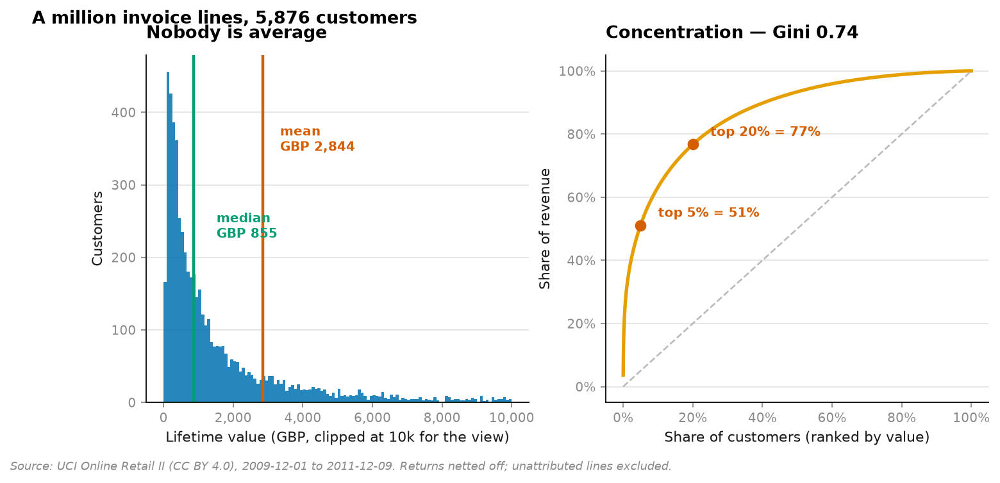
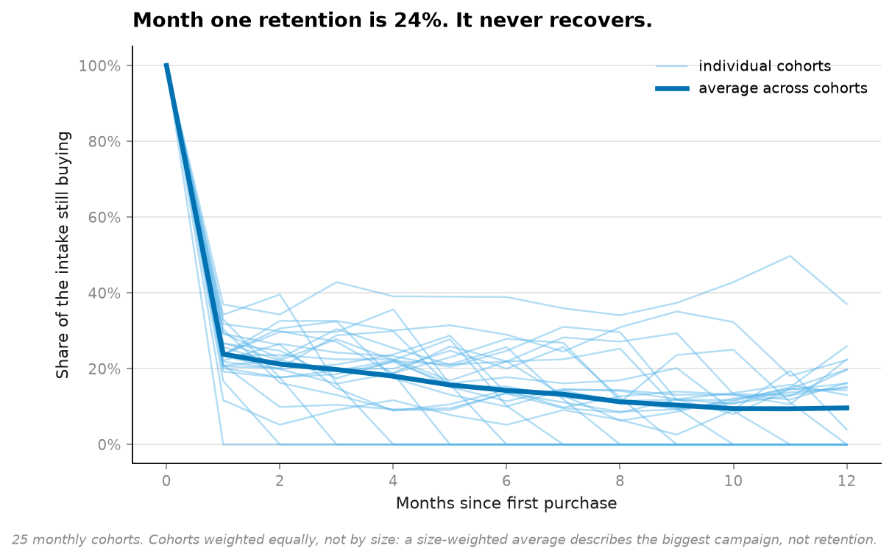
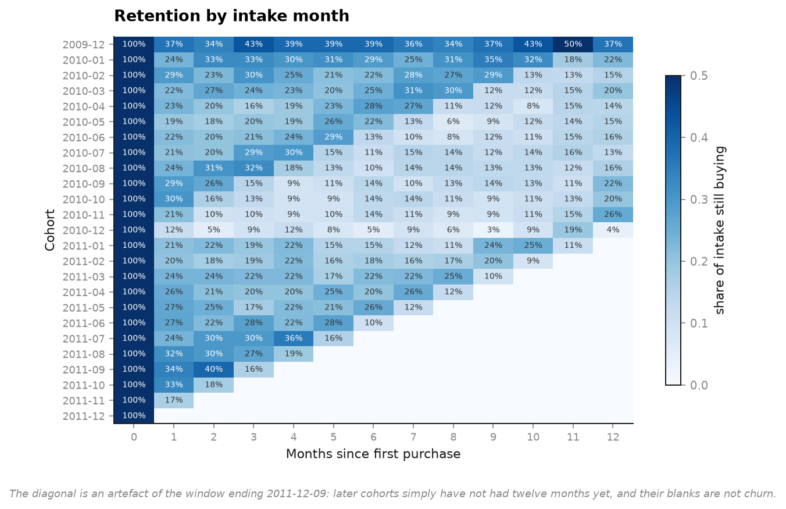
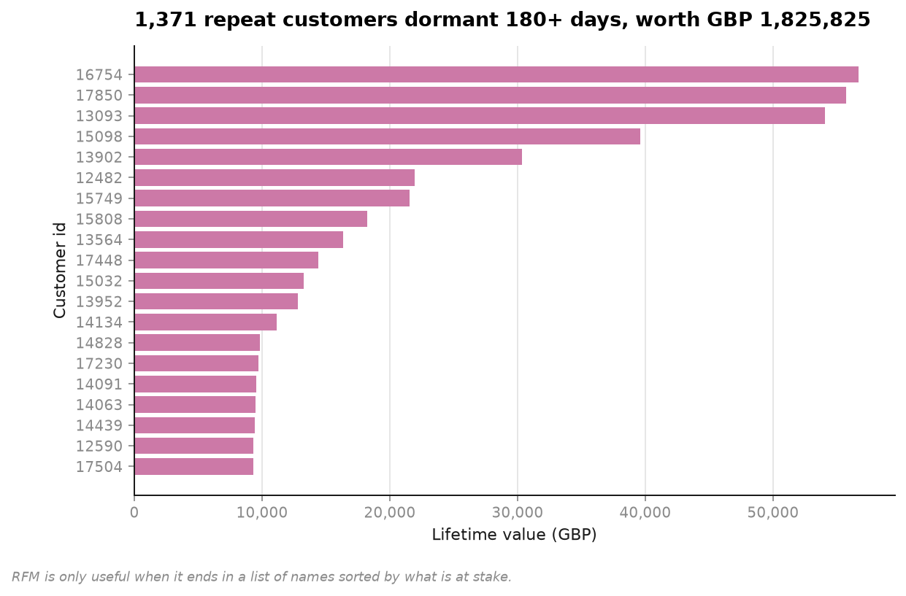

# 04 · Customer value — nobody is average (NumPy, pandas, Matplotlib)

**1,055,823 real invoice lines. 5,876 customers. Two years.**

```
mean value     GBP 2,844   <- the number that goes in the deck
median value   GBP   855   <- the typical customer

the mean sits at the 80th percentile
```

**Four customers in five are below average.** The mean describes a customer who does not
exist, and every plan built on it — acquisition budget, support staffing, discount depth —
is built on a fiction.



---

## Where the revenue actually is

```
top  1% of customers  ->  31.1% of revenue
top  5% of customers  ->  51.1% of revenue
top 10% of customers  ->  63.2% of revenue
top 20% of customers  ->  76.7% of revenue

Gini 0.736   |   24.4% of customers bought exactly once
```

Fifty-nine customers are half the business. Meanwhile a quarter of the customer base
bought once and never came back — and both facts are invisible in a single average.

## Retention




Cohorts are weighted **equally**, not by size. A size-weighted average is dominated by
whichever month ran the biggest campaign, which tells you about the campaign rather than
about retention.

The triangular blank area in the heatmap is not churn. The data ends 2011-12-09, so a
cohort that arrived in October 2011 simply has not had twelve months yet — a distinction
worth drawing explicitly, because read carelessly the shape looks like collapsing retention.

## Ending in a list of names



RFM is only useful when it stops being a statistic. The final chart is repeat customers
who have been dormant 180+ days, sorted by what is at stake — a call list, not a churn rate.

## Cleaning decisions, stated because each one changes the answer

| Decision | Why | Cost |
|---|---|---|
| **Returns kept** | A customer who bought GBP 500 and sent GBP 480 back is worth GBP 20 | 18,465 return lines |
| **Unattributed lines excluded** | Real sales, but they cannot join to a customer | 234,823 lines (22.2%) |
| **Non-positive prices dropped** | Adjustments and write-offs, not sales | — |
| **Postage and fees dropped** | Leave `POST` in and postage becomes a best-seller | — |
| **Invoices counted, not lines** | A basket of forty products is one purchase | — |

The 22.2% exclusion is the one worth arguing about. Those are genuine sales that simply
cannot be attributed, so every per-customer figure here describes the 78% who can be
identified. Stated rather than assumed harmless.

## Running it

```bash
uv run python projects/04-customer-value/run.py
```

First run converts a 45 MB Excel workbook to CSV (about a minute) and caches it. After
that, seconds.

**Data:** UCI Online Retail II, a UK gift wholesaler, 2009-12-01 to 2011-12-09, CC BY 4.0.

## Problems hit while building this

**The Excel file is inside the zip, and I fed the zip to `read_excel`.** It failed with
`KeyError: '[Content_Types].xml'` — openpyxl opened the outer archive, looked for the parts
of an xlsx, and found a different zip. Clear once read, opaque for a minute before that.

**`as_of` defaults to the day *after* the last transaction, not the last transaction.**
Using the final date gives the most recent buyer a recency of zero, which is fine until
something divides by it. A one-day offset that costs nothing and removes a whole class of
downstream failure.

## References

The statistical method this project implements and tests against real data comes from:

- Limpert, E., Stahel, W.A., Abbt, M. (2001). "Log-normal Distributions across the Sciences: Keys and Clues." *BioScience*, 51(5), 341-352. (why the arithmetic mean misleads under the right-skewed distributions this project's real invoice data actually shows)
