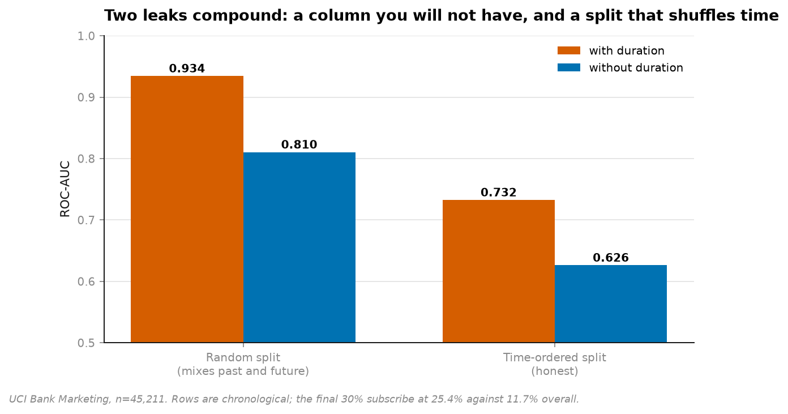
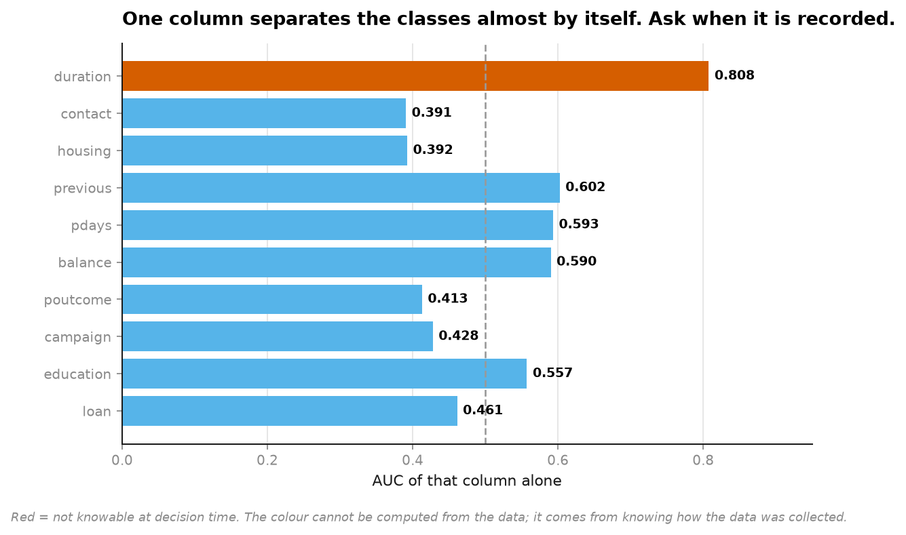
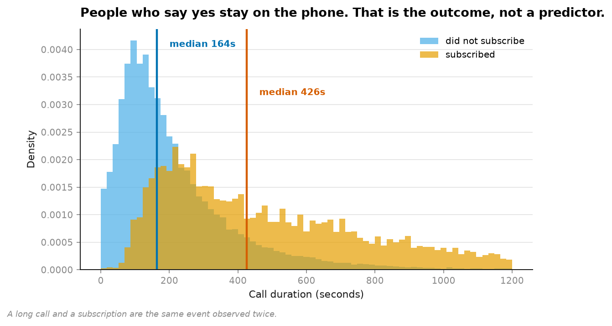
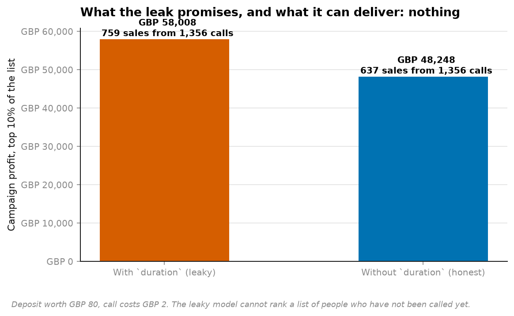

# 05 · Target leakage — the 0.93 that becomes 0.63 (NumPy, pandas, Matplotlib, scikit-learn)

**45,211 real phone calls offering a term deposit.** The published benchmark for this
dataset is around 0.93 ROC-AUC. Fix two things and it is 0.63.

```
             split          features    ROC-AUC   test positive rate
      random split     with duration      0.934               11.8%
      random split  without duration      0.810               11.8%
time-ordered split     with duration      0.733               25.4%
time-ordered split  without duration      0.626               25.4%
```



Neither fix is a modelling choice. Both are questions about **time**.

---

## Leak one: a column that does not exist yet

`duration` is how long the call lasted, in seconds. Alone, it separates subscribers from
non-subscribers at **AUC 0.808** — better than every other column combined.



UCI's own documentation says to throw it away:

> *"the duration is not known before a call is performed. Also, after the end of the call
> y is obviously known. Thus, this input should only be included for benchmark purposes and
> should be discarded if the intention is to have a realistic predictive model."*

Almost nobody discards it, because it is worth **+0.106 AUC** and 0.93 is the number that
goes in the notebook.



The mechanism, once drawn, is obvious: people who say yes stay on the phone. **A long call
and a subscription are the same event observed twice.** To know the call lasted eleven
minutes you must first have made an eleven-minute call — by which point the customer has
already answered and the prediction is worthless.

This is what makes leakage different from a bug. `duration` is not wrong, not noisy, and
not mismeasured. It is a genuine, powerful, perfectly recorded predictor that is simply
**unavailable at the moment the decision has to be made.**

## Leak two: a split that shuffles time

Found while checking the first one. The held-out slice subscribes at **25.4%** against
**11.7%** overall.

The rows are in chronological order, and the campaign changed partway through. A *random*
split scatters both regimes across train and test, so every fold gets to see the future.
That is worth another **0.18 AUC** on its own — larger than the column everyone argues
about.

## What it is worth in money



Calling the top 10% of a ranked list, deposit worth £80, call costs £2:

```
with duration (leaky)     1,356 calls   759 sales   56.0% conversion   £58,008
without duration          1,356 calls   637 sales   47.0% conversion   £48,248
```

The leaky model appears to be worth £9,760 more per campaign. **It is worth zero**, because
it cannot rank a list of people who have not been called yet. The gap is not an improvement
you would capture — it is the size of the lie.

## The audit, and its honest limit

```python
audit_columns(features, y, known_at_decision_time=KNOWN_BEFORE_DIALLING)
```

The first column — how strongly a feature separates the classes alone — is computed from
the data, with a rank-based AUC rather than a fitted model, so hyperparameters cannot bury
the signal.

**The second column cannot be computed.** Whether a feature exists at decision time comes
from knowing how the data was collected, and nothing in the file can tell you. That is the
honest part: *leakage detection is a conversation with the data owner, not a statistic.*
The automated half only says which conversations to have first.

## Running it

```bash
uv run python projects/05-leakage/run.py
```

Fetches 1 MB on first run, writes five figures and `result.json`. Around 30 seconds.

**Data:** UCI Bank Marketing (Moro, Cortez & Rita), 45,211 contacts from a Portuguese bank,
CC BY 4.0.

## Problems hit while building this

**I went looking for one leak and the data handed me a second.** The plan was `duration`
only. The temporal drift showed up as an anomaly in a print statement — a held-out positive
rate of 25.4% where 11.7% was expected — and chasing it produced the larger of the two
effects. The AUC everyone quotes for this dataset owes more to the split than to the
famous column.

**My own module docstring predicted 0.79 and 0.93 before anything was run.** The measured
figures were 0.810 and 0.934. Recorded because the prediction was made in writing first,
and a guess that survives contact with the data is worth more than one written afterwards.
