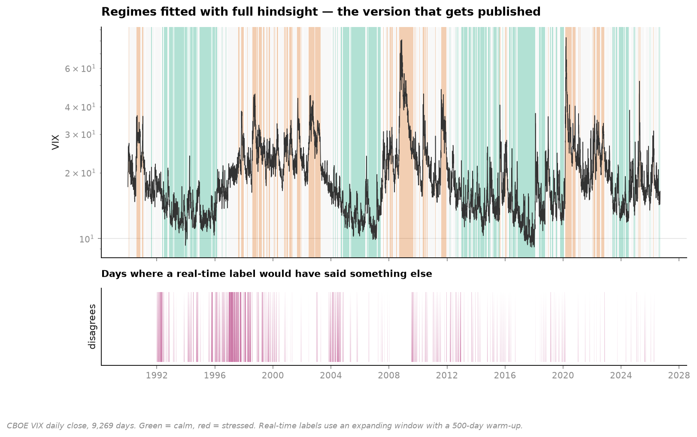
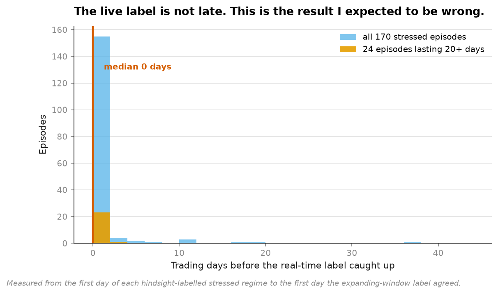
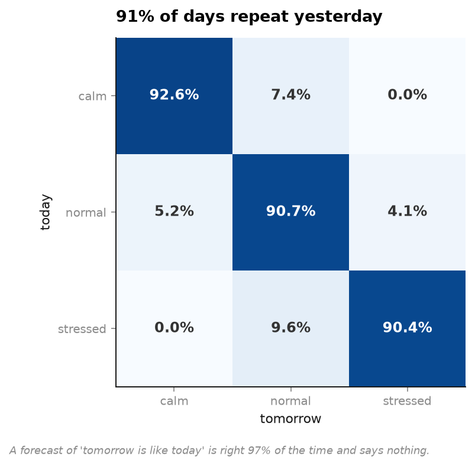
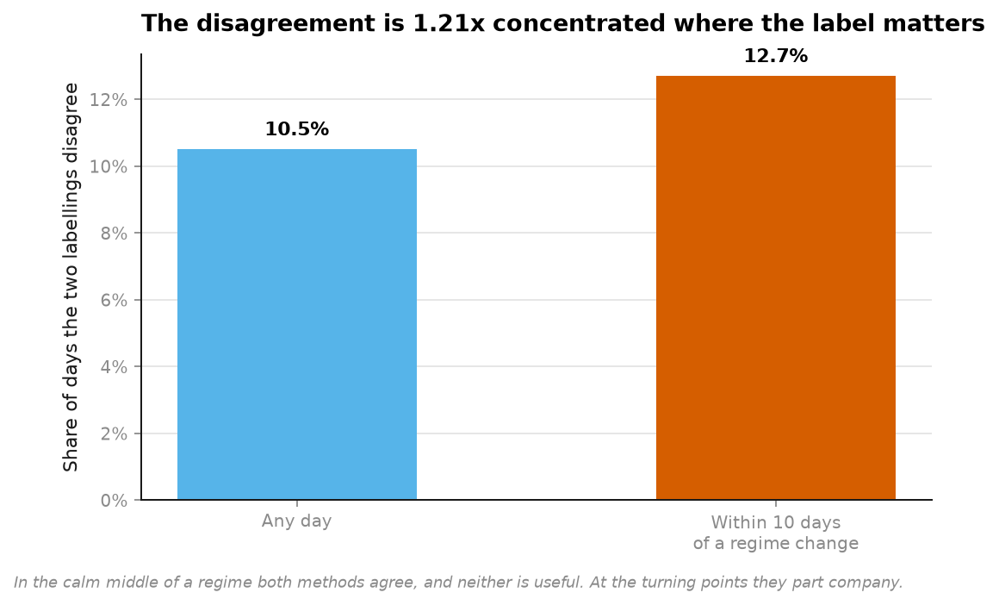

# 06 · Volatility regimes — the project where I was wrong twice

**9,269 trading days of CBOE VIX, 1990 to 2026.**

This project set out to demonstrate hindsight bias in regime detection. The data refused,
and that is the result.



---

## What I expected

Every volatility chart has the calm stretches and the crises shaded on it, and they look
obvious — *afterwards*. So the plan was to label the series twice and show the gap:

- **hindsight** — thresholds fitted on the whole history, applied to the whole history.
  This is what gets published. It uses the future.
- **real time** — at each day, thresholds fitted only on what came before. The only version
  that could have been acted on.

Two predictions, written before running anything:

1. The disagreement between them would be **concentrated at the turning points** — the days
   when a label is actually worth something.
2. The real-time label would arrive **weeks late** to every crisis.

## What happened

```
agreement between the two labellings            89.5% of 8,769 days
disagreement, any day                           10.5%
disagreement, within 10 days of a regime change 12.7%     concentration: 1.21x

stressed episodes of any length   170 episodes   median lag 0 trading days
episodes lasting 20+ days          24 episodes   median lag 0 trading days
```



**Both predictions were wrong.** The concentration is 1.21× — real, but nothing like the
effect I described. And the real-time label is not late at all: across 24 major stress
episodes lasting a month or more, the median delay is **zero trading days**.

## Why — and why it does not generalise

VIX is an **observed level**, not a latent state. On any given morning you can read it off
a screen. Classifying "is today's number high by historical standards" needs only
historical standards, which you have.

That is not true of the regimes people usually mean. A recession, a bull market, a change
in customer behaviour — those are latent states inferred from noisy indicators, and *those*
are where hindsight labelling flatters itself. The lesson is not "regime detection is
fine". It is that the hindsight problem lives in the **inference**, and VIX barely has any.

The 10.5% that does disagree is worth being precise about. It is mostly the boundary
wobbling: 33.1% of days are calm under hindsight thresholds, 36.0% under real-time ones,
because the expanding window has not yet seen 2008 when it is classifying 1997.

## Persistence, and why it is not an achievement



```
persistence: 91.2% of days share yesterday's regime

P(tomorrow | today)      calm    normal   stressed
calm                    92.6%      7.4%       0.0%
normal                   5.2%     90.7%       4.1%
stressed                 0.0%      9.6%      90.4%
```

A model that forecasts "tomorrow is like today" is right nine times in ten. Any regime
model must be measured against *that*, not against a coin flip — and a great many published
regime models are not.



## Running it

```bash
uv run python projects/06-volatility-regimes/run.py
```

Fetches 482 KB on first run, writes four figures and `result.json`. Around 30 seconds.

**Data:** CBOE VIX daily close since 1990-01-02, via `datasets/finance-vix`. VIX history is
published freely by CBOE.

## Problems hit while building this

**Both hypotheses failed, and the write-up changed rather than the analysis.** The first
draft of this README was written expecting a large concentration effect and a multi-week
lag. Neither survived. The temptation at that point is to tune the window, move the
quantiles, redefine "turning point" until something appears — which is precisely the
overfitting-by-search that [project 01](../01-backtest-overfitting/) exists to measure.
The thresholds are the ones chosen before seeing any output.

**Counting all 170 stressed runs was hiding the question.** Most are one- and two-day
flickers that every method catches instantly and nobody trades. Splitting out the 24
episodes lasting 20+ days was the right analysis, and it gave the same answer — which is
the only reason it is reported rather than being a second bite at the cherry.
