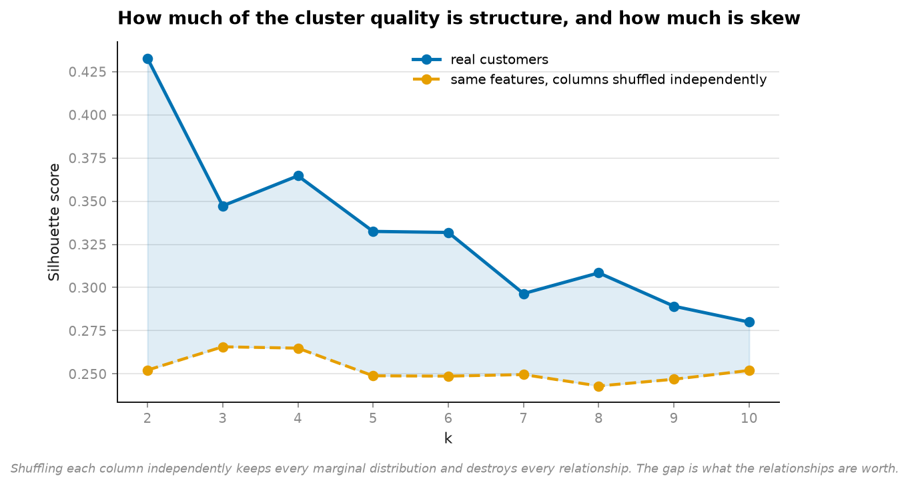
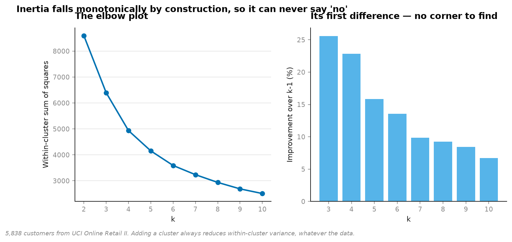
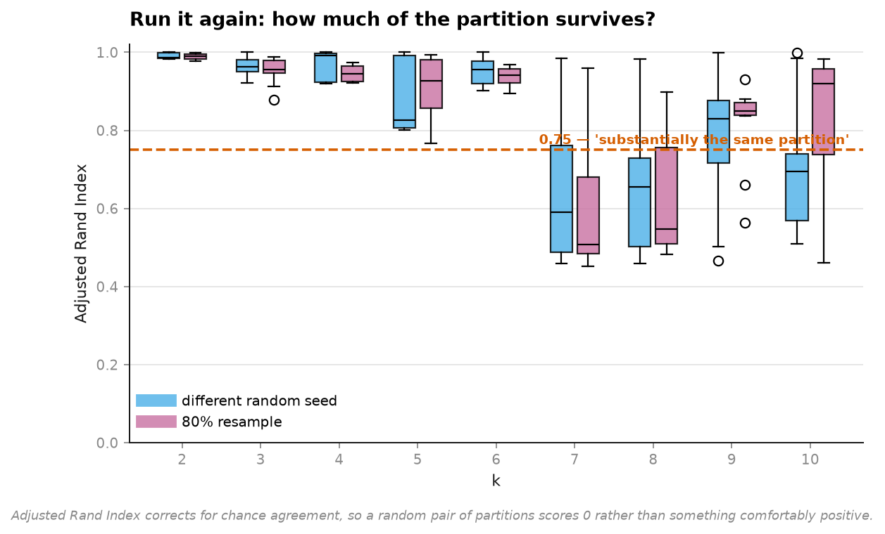
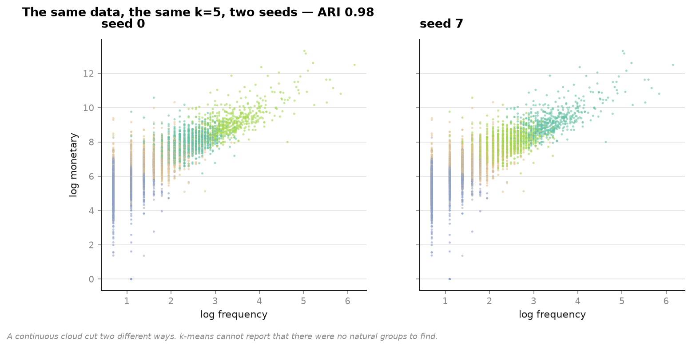

# 07 · Customer segments — do they survive being asked twice? (NumPy, pandas, Matplotlib, scikit-learn)

**5,839 real customers, three RFM features.** Every marketing deck has five segments with
names like "Loyal Champions". k-means will return five segments from any data you give it,
including data with no group structure at all.

```
 k   silhouette   on shuffled   excess   reseed ARI   resample ARI   verdict
 2        0.433         0.252    0.181        0.997          0.993   stable, beats null
 3        0.347         0.266    0.082        0.963          0.959   stable, beats null
 4        0.365         0.265    0.100        0.969          0.957   stable, beats null
 5        0.333         0.249    0.084        0.847          0.832   stable, beats null
 6        0.332         0.249    0.083        0.954          0.928   stable, beats null
 7        0.296         0.250    0.047        0.595          0.498   NOT REPRODUCIBLE
 8        0.308         0.243    0.066        0.658          0.550   NOT REPRODUCIBLE
 9        0.289         0.247    0.042        0.838          0.858   stable, beats null
10        0.280         0.252    0.028        0.706          0.709   NOT REPRODUCIBLE
```

**The column that matters is `on shuffled`.** Take the same three features, permute each
one independently — every marginal distribution preserved, every relationship destroyed —
and k-means still scores a silhouette of **0.25**.

So "we found five segments with a silhouette of 0.33" is a claim to **0.08 above what
structure-free data earns**. Most of the score is skew, not structure.



---

## The elbow plot cannot say no



```
k=3  improvement over k=2: 25.6%
k=4                        22.8%
k=5                        15.9%
k=6                        13.5%
k=7                         9.9%
k=8                         9.2%
```

Inertia falls monotonically **by construction** — adding a centroid always reduces
within-cluster variance, whatever the data. There is no corner here because there is no
corner to find, and the method has no way to return "none of these".

## Run it again



Two harder questions than "how good is this partition":

- **reseed** — same data, different random initialisation. If the segments move, they were
  an artefact of where the centroids started.
- **resample** — 80% of customers, drawn again. If the segments move, they describe this
  sample and not the business.

Agreement is Adjusted Rand Index, which is corrected for chance so a random pair of
partitions scores 0 rather than something comfortably positive.

k=2 through 6 are reproducible (ARI 0.83–0.99). **k=7 and 8 collapse** to 0.50–0.66 — run
those twice and you get materially different segments from identical data.



## What this does and does not show

It does **not** show that customer segmentation is worthless. k=2 clears the null by 0.18
and repeats almost perfectly, and k=4 is stable with a 0.10 excess. There is real structure
in this data.

What it shows is that **the structure is thin and it runs out fast**. The excess over the
null shrinks from 0.181 at k=2 to 0.028 at k=10 — by the time you have ten segments you are
describing noise with names. And the most commonly chosen k in practice, five, buys 0.084.

`n_init=1` throughout, deliberately. scikit-learn defaults to ten restarts and keeps the
best, which hides precisely the instability being measured. The question is not "what is
the best partition this algorithm can find" but "what does a practitioner get when they run
it" — and a practitioner who runs it twice deserves to see both answers.

## Why log-transform first

RFM is heavily skewed and k-means minimises squared distance. On raw values a handful of
whales define every centroid and the segments become "one whale, and everybody else",
repeated k times. Logs before scaling; stated because it changes the answer.

## Running it

```bash
uv run python projects/07-segmentation-stability/run.py
```

Reuses the cached Online Retail II data from [project 04](../04-customer-value/). Around a
minute — the stability checks fit k-means roughly 400 times.

**Data:** UCI Online Retail II, CC BY 4.0.

## Problems hit while building this

**The expected headline was "segments are fake" and the data did not support it.** k=2
through 6 are genuinely reproducible. The honest result is quieter and more useful: the
structure is real, thin, and exhausted by about k=6 — and the only way to see that is to
run a null that nobody runs.

**k=9 is stable and k=7, 8 and 10 are not, which I cannot explain.** It is reported as
measured rather than smoothed away. A plausible story is that k=9 happens to align with a
natural split the other values cut across, but it is a story, and one run of one dataset is
not enough to tell it.

## References

The statistical method this project implements and tests against real data comes from:

- Rousseeuw, P.J. (1987). "Silhouettes: A Graphical Aid to the Interpretation and Validation of Cluster Analysis." *Journal of Computational and Applied Mathematics*, 20, 53-65.
- Hubert, L. and Arabie, P. (1985). "Comparing Partitions." *Journal of Classification*, 2(1), 193-218. (the Adjusted Rand Index used here to test reseed/resample stability)
