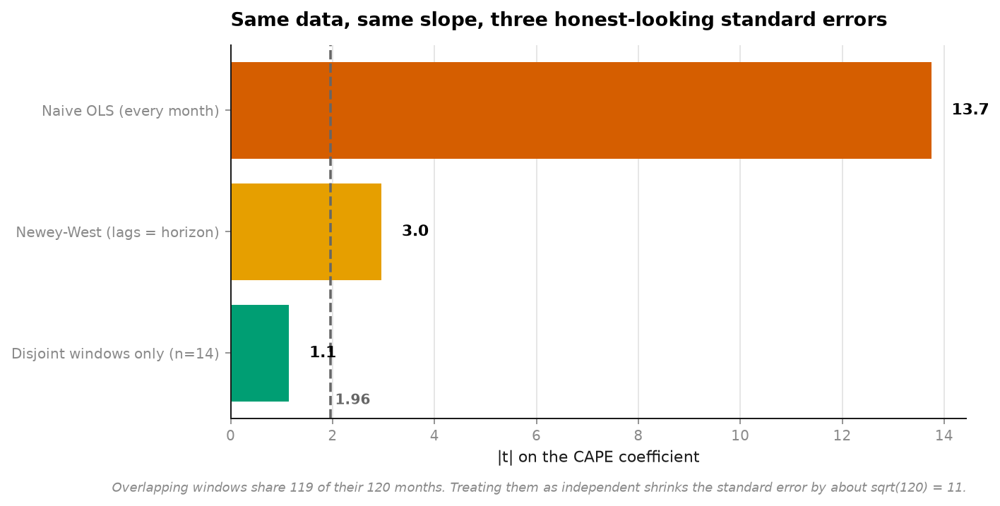
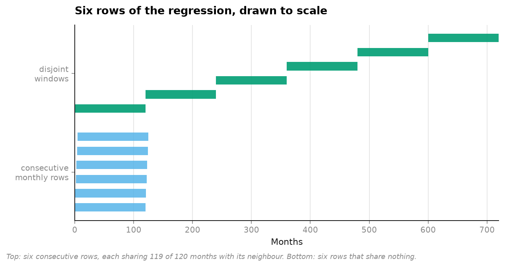
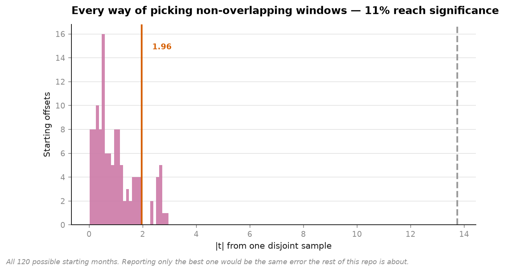
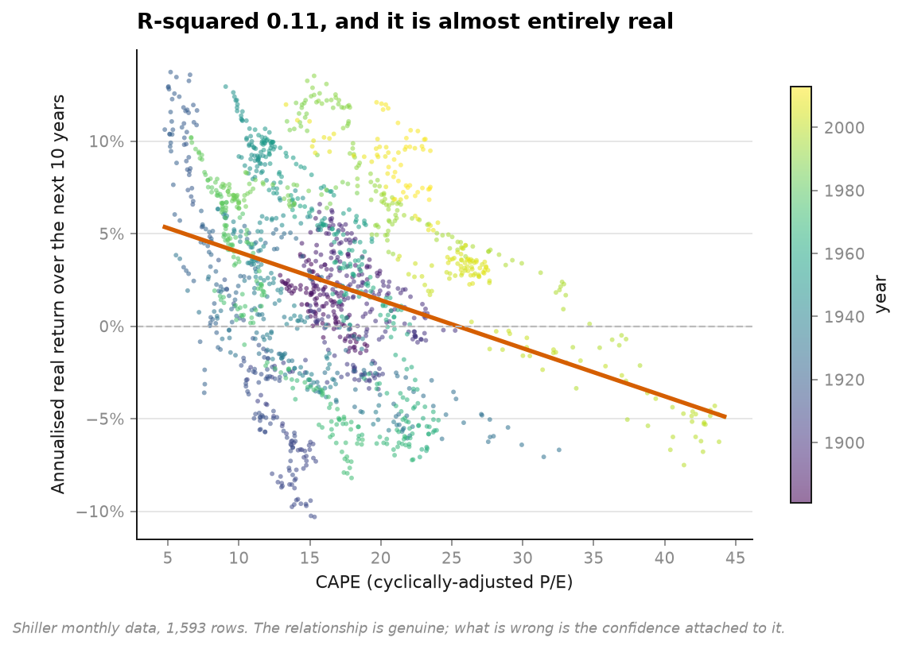

# 08 · Overlapping windows — how t = 13.75 becomes t = 1.15

**145 years of Shiller's S&P 500 data.** Does valuation predict long-run returns?

```
method                              slope    std err        t        p   indep n   significant
Naive OLS (every month)          -0.00260    0.00019   -13.75   0.0000     1,593   yes
Newey-West (lags = horizon)      -0.00260    0.00088    -2.96   0.0127        13   yes
Disjoint windows only (n=14)     -0.00268    0.00234    -1.15   0.2743        14   NO
```

**Same data. Same slope. Three standard errors.** One of them says this is among the most
established facts in finance. Another says you cannot reject chance.



---

## The arithmetic

1,593 monthly rows of *(CAPE today, real return over the next ten years)*.

The ten-year window starting January 1990 shares **119 of its 120 months** with the window
starting February 1990. Those are not two observations. They are one observation reported
twice with a one-month shuffle.



In 145 years there are **13** genuinely non-overlapping ten-year periods. Thirteen. Every
standard error computed as though there were 1,593 is too small by about `sqrt(120)`.

```
naive t / honest t  = 12.0
sqrt(horizon)       = 11.0
```

The predicted inflation factor and the measured one agree to within 10%. This is not a
subtle statistical dispute — it is a units error with a known size.

## The part that stops it being cherry-picking

There are 120 ways to choose disjoint windows: start in month 0, or month 1, or month 2.
Reporting whichever one looks best would be exactly the sin
[project 01](../01-backtest-overfitting/) exists to measure. So all 120 are run:



```
significant at 5%:  11% of the 120 offsets
|t| range:          0.03 to 2.96   (median 0.77)
```

Eleven per cent, where 5% is what pure chance would deliver. There may be something here —
the slope is consistently negative — but it is nothing like `t = 13.75`.

## The relationship is real. The confidence is not.



R² = 0.106, and the negative slope is visible. **Nothing here says CAPE is uninformative.**
What it says is that 145 years of monthly data contains thirteen independent ten-year
experiments, and thirteen experiments do not support a four-decimal p-value.

## The same error, in three fields

This is the third time this bug class appears in work I've built:

| Field | What was counted | What was independent |
|---|---|---|
| Finance (here) | 1,593 monthly windows | 13 decades |
| Genomics (`clcuv-surveillance`) | 8 sequenced genomes | 1 clonal haplotype |
| Research agents | 12 news outlets | 1 wire story |

**The unit of observation is not the row.** No amount of correct arithmetic downstream
repairs getting that wrong, and in all three cases every intermediate number was computed
perfectly.

## Running it

```bash
uv run python projects/08-overlapping-windows/run.py
```

Fetches 124 KB on first run, writes four figures and `result.json`. A few seconds.

**Data:** Robert Shiller's long-run series (Yale) via `datasets/s-and-p-500` — monthly real
price, dividends, earnings, CPI and CAPE from 1871. The usable window here is 1881-01 to
2013-09, bounded by CAPE needing ten years of earnings history at the start and a ten-year
forward return at the end.

## Problems hit while building this

**Newey-West lands between the two, and it is worth saying why it is still generous.** With
lags set to the horizon it recovers t = -2.96 against the naive -13.75 — most of the
correction. But it assumes the overlap is the *only* dependence, and long-horizon returns
are also driven by slow-moving common factors that outlast a ten-year window. It is better
than naive OLS and it is not the honest answer.

**The disjoint estimate has fourteen points, and that is the actual state of the evidence.**
It is tempting to read `n=14` as a failure of method. It is not. It is what 145 years of
monthly data contains once you stop counting the same decade 120 times.
