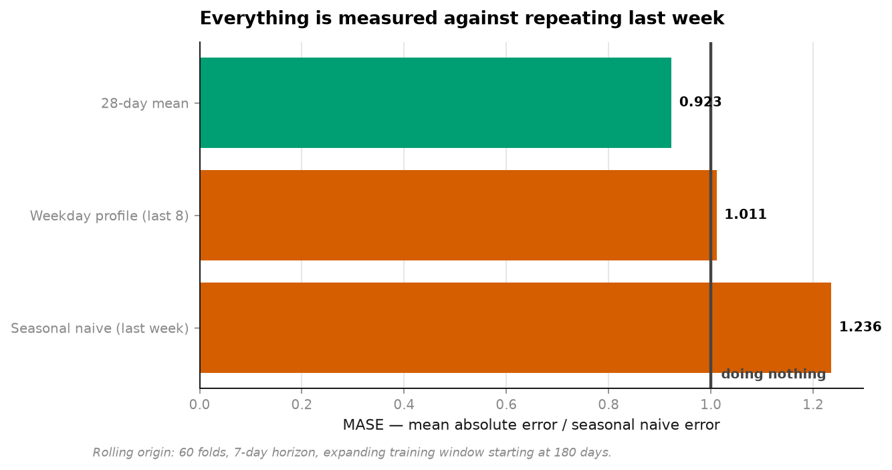
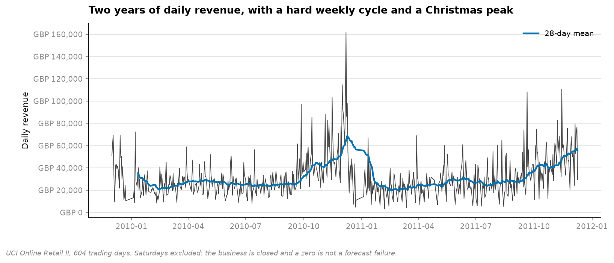
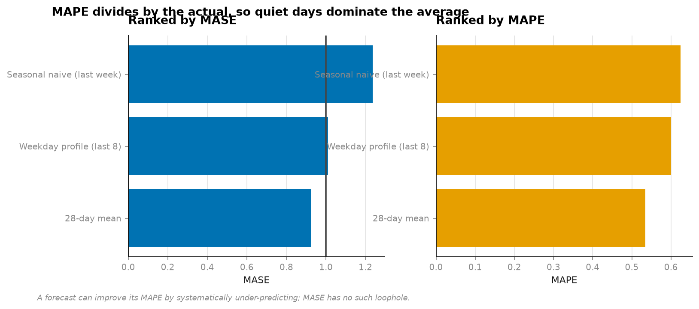
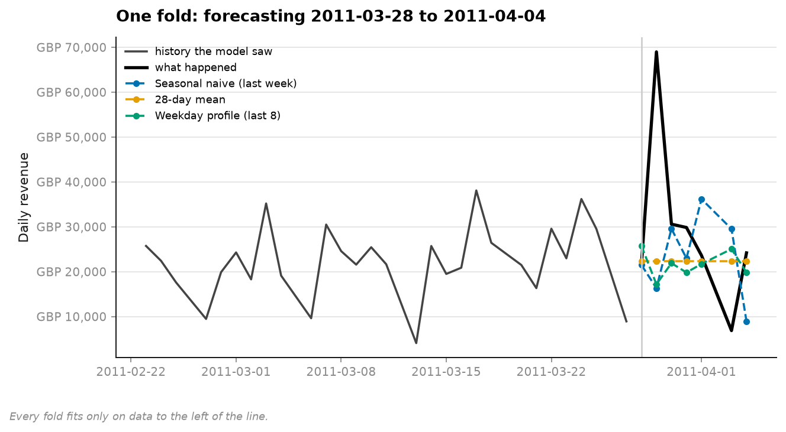

# 09 · Forecast backtesting — the baseline is the result (NumPy, pandas, Matplotlib)

**604 trading days of a real wholesaler's revenue, 60 rolling folds, 7-day horizon.**

```
model                        MASE     MAPE       bias   beats naive
28-day mean                 0.923    53.4%     -1,290   yes
Weekday profile (last 8)    1.011    60.0%     -2,013   no
Seasonal naive (last week)  1.236    62.4%       -556   no
```



**A flat 28-day average beats both models that know about the weekly cycle.** It beats
repeating last week by 25%, and beats a fitted weekday profile by 9%.

---

## Why that is surprising, and why it holds



The weekly cycle is the most visible feature of the chart. It is also, at a 7-day horizon,
not worth modelling: forecasting a whole week ahead means every weekday is predicted
exactly once, so the *shape* within the week cancels out and only the *level* matters. The
flat mean estimates the level from 28 observations; seasonal naive estimates it from one.

This would reverse at a 1-day horizon, where the weekday matters enormously. The lesson is
not "seasonality is overrated" — it is that **the horizon decides which structure is worth
capturing**, and a model chosen without reference to the horizon is chosen at random.

## MASE, not MAPE

MAPE divides by the actual value. A day selling 2 units forecast at 4 contributes 100%
error; a day selling 2,000 forecast at 2,400 contributes 20%. Quiet days dominate, a
forecast can improve its MAPE by systematically under-predicting, and on any series with a
zero it is undefined.

MASE divides by the error of a seasonal naive forecast **on the training data**, so it
reads directly:

```
MASE < 1   better than repeating last week
MASE = 1   exactly as good as doing nothing
MASE > 1   worse than nothing, with a maintenance cost
```

One precision worth stating: seasonal naive scores 1.236 rather than exactly 1.0 because
the denominator is its *in-sample* error and the folds are genuinely harder than the
training window. The clean comparison is model-to-model — 0.923 against 1.236 is a 25% gap.



## Every model runs low

```
28-day mean                 bias  -1,290
Weekday profile             bias  -2,013
Seasonal naive              bias    -556
```

All three under-forecast, by GBP 550 to GBP 2,000 a day. **No accuracy metric shows this.**
A forecast can have excellent MASE and empty a warehouse slowly, which is why bias is
reported next to accuracy on every row rather than in an appendix.

## Rolling origin, not one split



Fit on everything up to time t, forecast the next 7 days, roll forward, repeat — 60 times.
A single train/test split on a time series gives one number with invisible error bars, and
whether that number was lucky is unknowable.

## Two cleaning decisions

**135 zero-revenue days removed as closures.** The business does not trade on Saturdays. A
zero there is a closed shop, not demand of zero, and leaving them in makes every model
appear to fail one day in seven.

**`embargo` is available and set to 0 here.** It drops the last few training points, which
is unnecessary for a plain forecast — the target is genuinely in the future — but becomes
essential the moment a feature is a trailing window, because a 7-day rolling mean computed
at the last training point already contains days belonging to the test set.

## Running it

```bash
uv run python projects/09-forecast-backtest/run.py
```

Reuses the cached retail data from [project 04](../04-customer-value/). A few seconds.

**Data:** UCI Online Retail II, CC BY 4.0.

## Problems hit while building this

**I predicted MAPE and MASE would rank the models differently. They didn't.** Both put the
28-day mean first and seasonal naive last. The argument for MASE stands on its properties —
the undefined-at-zero problem and the under-prediction loophole are real — but this dataset
did not demonstrate them, and the README says so rather than implying a disagreement that
is not in the table.

**The expected winner was the weekday profile and it came third.** It has more parameters
than the flat mean and uses them to fit a pattern that a 7-day horizon averages away. The
result was not obvious in advance, which is the argument for running the baseline before
building anything.
