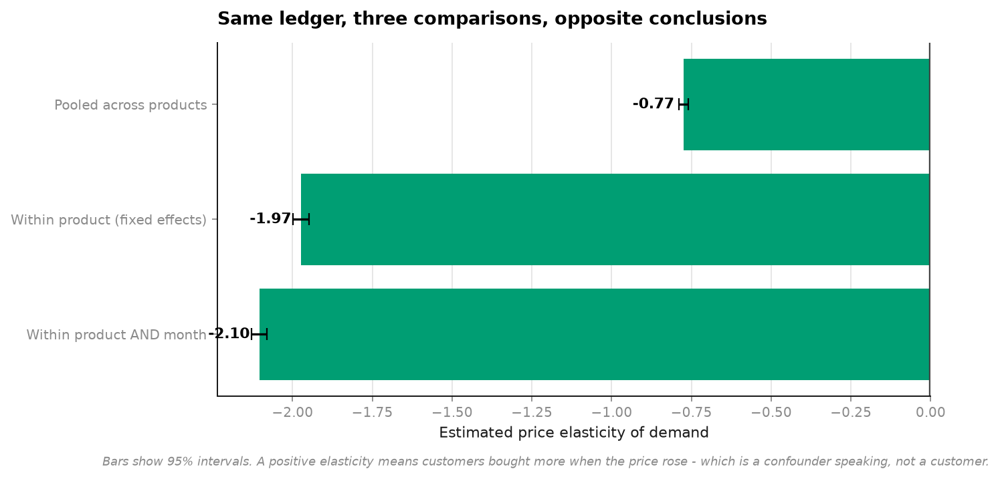
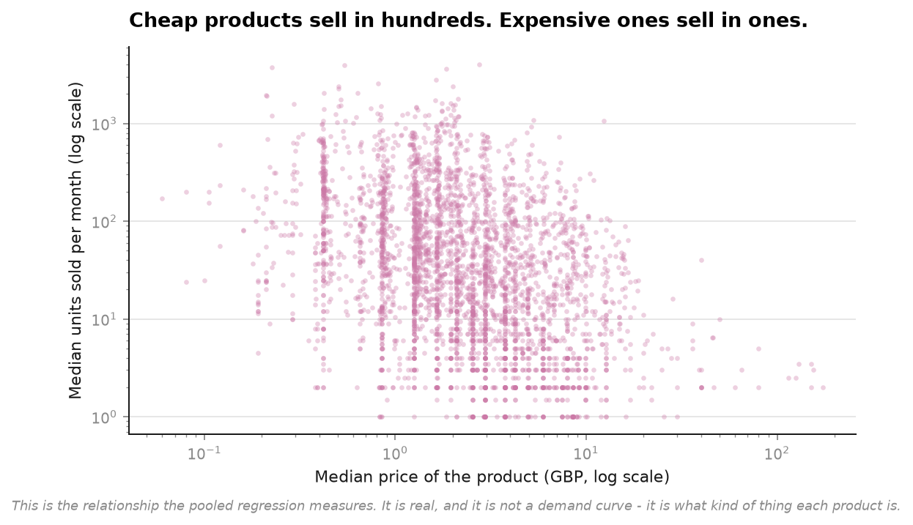
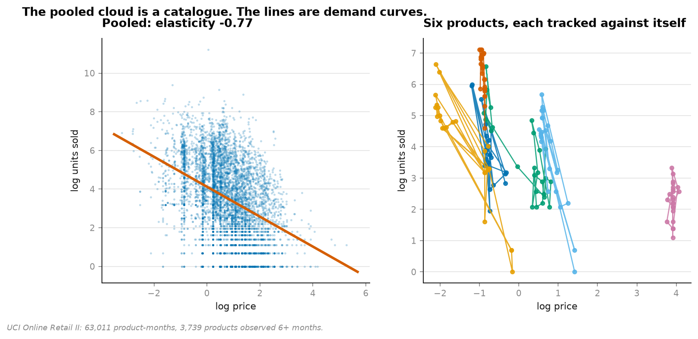
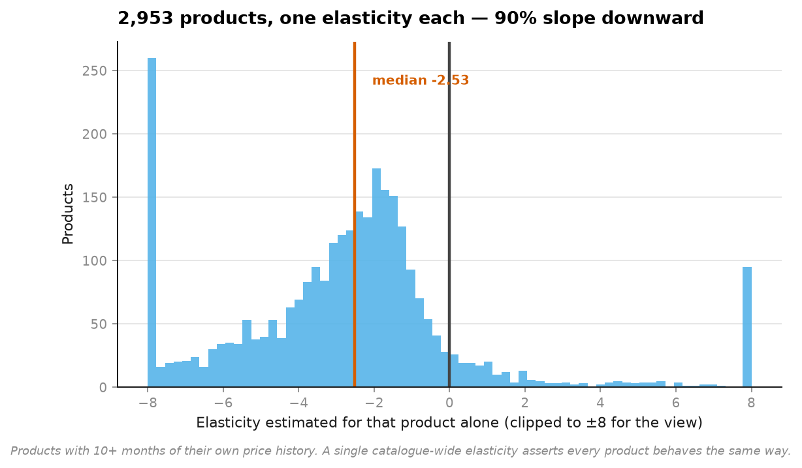

# 10 · Price elasticity — the confounder that reverses the business decision (NumPy, pandas, Matplotlib)

**63,011 product-months across 3,739 real products.**

```
method                            elasticity   std err        t
Pooled across products                -0.774     0.007   -108.5
Within product (fixed effects)        -1.974     0.013   -153.7
Within product AND month              -2.104     0.012   -168.5
```



All three are negative, so nothing here looks obviously broken. **The pooled estimate is
still wrong in the way that matters**, because it lands on the wrong side of the only
threshold pricing cares about:

| | Meaning | What you should do |
|---|---|---|
| **\|e\| < 1** — inelastic | demand barely responds | **raise prices, revenue rises** |
| **\|e\| > 1** — elastic | demand responds more than the price moves | **raise prices, revenue falls** |

Pooled says **0.77 — inelastic. Raise prices.**
Within-product says **1.97 — elastic. Raising prices costs you money.**

Same ledger, opposite instruction.

---

## What the pooled regression is actually measuring



**The confounder is the product.** A GBP 40 hamper and a GBP 0.85 greetings card differ in
price by a factor of fifty and in units sold by a factor of hundreds. Regressing across
both measures *what kind of thing this is*, not *what happens when its price changes*.



Left: the pooled cloud, which is a picture of a catalogue. Right: six products each tracked
against itself over time — those are demand curves.

The fix is not a better model. It is a better comparison: subtract each product's own mean
log price and log units, and regress the deviations. Algebraically a fixed-effects
regression with one dummy per product, without building a 3,739-column matrix.

Adding month fixed effects on top removes anything that moved the whole catalogue at once —
Christmas, a recession, a postage change — and nudges the estimate to 2.10.

## One number hides 1,500 different answers



A single catalogue-wide elasticity asserts every product responds the same way. Fitting one
elasticity per product with 10+ months of its own history:

```
2,953 products with their own estimate
median elasticity          -2.53
slope downward             89.7%
```

The median individual product is **more** elastic than any pooled estimate, and 10% slope
upward — which is not a discovery about Veblen goods but a reminder that ten months of one
product's price history is thin evidence, and some of those estimates are noise.

## What this still cannot claim

**Prices are not set at random**, and no amount of demeaning fixes that. They fall when
demand is weak and rise when it is strong, which biases the estimate in both directions at
once. The within-product number is a better description of the association than the pooled
one; it is not a causal effect.

Getting a causal elasticity needs an instrument or an experiment. A historical ledger
contains neither, and saying so is the honest end of the analysis rather than a caveat
buried under a recommendation.

## Two data decisions that change the answer

**Returns excluded.** A refund is not a purchase at a negative price, and letting negative
quantities through makes `log(units)` undefined for exactly the products with the most
interesting price histories.

**Revenue-weighted price, not mean listed price.** A product sold 500 times at GBP 1.00 and
once at GBP 9.99 was, in that month, a GBP 1.00 product. Taking the mean of listed prices
would call it GBP 5.50.

## Running it

```bash
uv run python projects/10-price-elasticity/run.py
```

Reuses the cached retail data from [project 04](../04-customer-value/). Around 20 seconds.

**Data:** UCI Online Retail II, CC BY 4.0.

## Problems hit while building this

**I expected the pooled estimate to come out positive and it didn't.** The textbook version
of this demonstration has the naive regression showing customers buying *more* at higher
prices. On this catalogue the pooling bias is large but not large enough to flip the sign —
it only understates elasticity by 61%.

That turned out to be the better finding. A sign flip is obviously wrong and somebody would
catch it. **An elasticity of 0.77 looks completely reasonable, is precisely estimated with a
t of 108, and tells you to do the opposite of the right thing.** Plausible wrong answers do
more damage than absurd ones.
