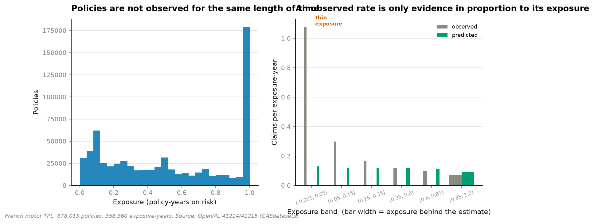
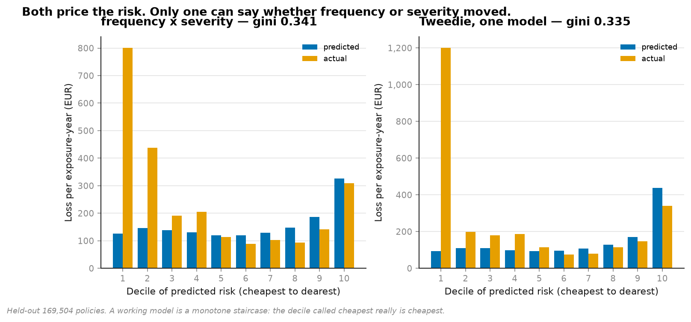
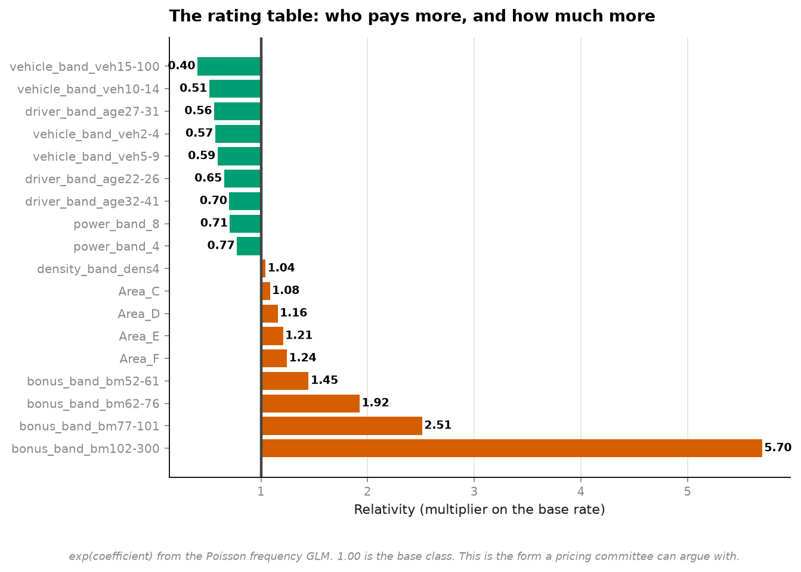
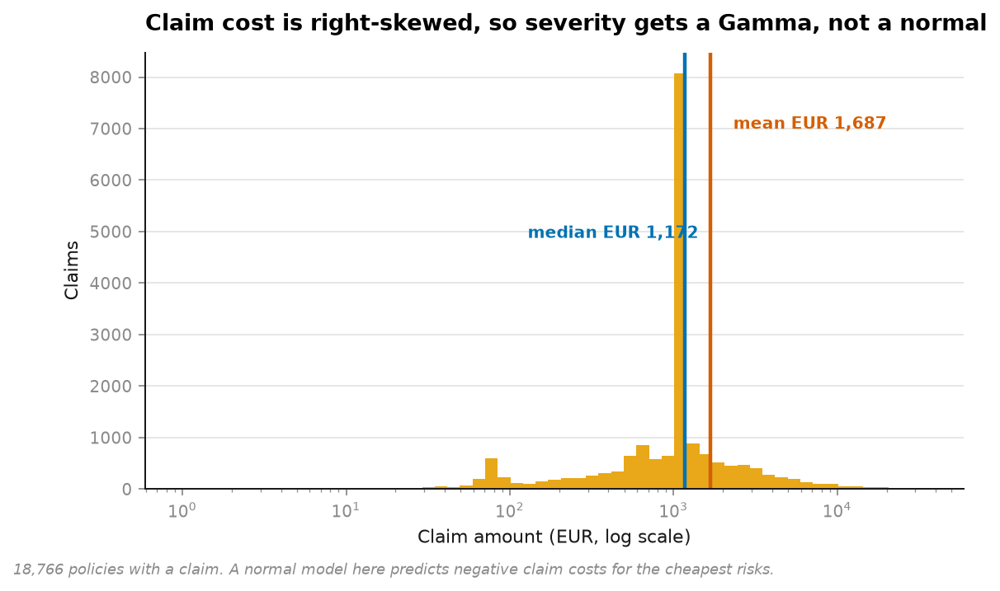

# 11 · Insurance pricing — the one argument that breaks the price (NumPy, pandas, Matplotlib, statsmodels)

**678,013 real French motor policies. 358,360 policy-years of exposure. 26,639 claims.**

```
                        expected claims, one policy
                        2-week policy   annual policy   ratio
with log(exposure)             0.0084          0.0888      9%
WITHOUT the offset             0.0552          0.0502    110%
```

**A model without the exposure offset charges a two-week policy more than an annual one.**

That is the whole project. One argument — `offset=log(Exposure)` — separates a working
price from a broken one, and it is omitted constantly because nothing errors when you
leave it out.



---

## Why it happens

Policies are not observed for the same length of time. Exposure here runs from 0.003 to
1.0 policy-years — a factor of 300.

Model `ClaimNb` directly and you fit:

```
log(E[count]) = Xβ
```

which learns that long policies have more claims. True, useless, and it prices a one-month
policy as though a month of risk were a year of it. The offset turns the same model into:

```
log(E[count] / exposure) = Xβ        ← a model of rates
```

## Two models, not one

```
pure premium  =  E[claims per year]  ×  E[cost per claim]
                 ---- Poisson ----      ---- Gamma ----
```



```
frequency × severity     gini 0.3406    actual/predicted 0.951    €171/year
Tweedie, one model       gini 0.3351    actual/predicted 0.971    €167/year
```

A single Tweedie GLM prices almost identically, and insurers still mostly don't use one.
The reason isn't accuracy — it's that when next year's loss ratio moves, **somebody has to
say whether people crashed more often or more expensively.** Those have completely
different responses, and a combined model cannot tell them apart.

## The rating table



`exp(coefficient)` is a multiplier, so the output reads the way a rating table is published:
a base rate, then relativities. 1.35 means "35% more claims than the base class" — a
sentence an underwriter can argue with. Reporting raw coefficients instead is how a pricing
discussion stops being a discussion.

## Why severity gets a Gamma



Mean claim €1,687, median €1,172 — right-skewed, positive, with variance growing in the
mean. A normal model here predicts **negative claim costs** for the cheapest risks, which is
not a rounding error but a nonsense.

Fitted on the 18,766 policies that actually claimed. Including the other 95% would be
modelling the cost of a claim that did not happen.

One claim in this dataset is €4.075 million. The 99.5th percentile cap moves 94 losses and
is stated rather than hidden — without it, a single accident sets everyone's premium.

## Two things I got wrong, and what they taught

### The evaluation was measuring exposure and calling it risk

First run: the correct model scored **Gini −0.03** and the broken one **+0.22**.

`gini()` ranked policies by predicted *count*. Exposure varies by 300×; the risk
relativities vary by about 3×. **Sorting by predicted count is sorting by exposure with a
rounding error attached.** Fixed by ranking on predicted *rate*, after which the numbers
became 0.26 and 0.31.

### An observed rate is only evidence in proportion to its exposure

```
exposure band     policies   exp-yrs   observed  predicted  % claiming  credible
(0.00, 0.05]        12,228       338     1.0754     0.1285       2.86%  NO
(0.05, 0.15]        26,887     2,481     0.2982     0.1204       2.63%  yes
(0.15, 0.35]        28,337     6,999     0.1652     0.1167       3.92%  yes
(0.35, 0.60]        30,276    14,380     0.1161     0.1169       5.18%  yes
(0.60, 0.85]        20,429    14,816     0.0962     0.1123       6.47%  yes
(0.85, 1.00]        51,347    50,644     0.0701     0.0900       6.60%  yes
```

The shortest band appears to run at **1.08 claims per year** against a portfolio average of
0.10 — a tenfold model failure, and I nearly wrote it up as one.

It is a small denominator. One claim on a policy in force for 0.02 years is an *empirical*
rate of fifty a year. The tell is the last column: those same policies have the **lowest**
share claiming at all — 2.86% against 6.60% for annual ones. They are not dangerous, they
are briefly observed.

`credible_bands()` now carries the exposure behind every estimate and flags thin ones
rather than plotting them at equal weight. That is credibility theory in its simplest form,
and the reason actuaries invented it.

**A note on the Gini comparison, in the same spirit:** the no-offset model still scores
higher (0.31 vs 0.26). It ranks short policies as high-risk, and short policies *do* show
high observed claims-per-exposure — for exactly the small-denominator reason above. It
wins on a metric contaminated by the same artifact, which is why the pricing table, not the
Gini, is the headline here.

## Running it

```bash
uv run python projects/11-insurance-pricing/run.py
```

First run fetches 36 MB (frequency) + 377 KB (severity). Around two minutes.

**Data:** freMTPL2freq / freMTPL2sev via OpenML 41214 / 41215, originally CASdatasets.
678,013 policies, GPL-2.

## What this does not claim

- **Prices here are pure premium**, not a quoted price. No expenses, no profit loading, no
  reinsurance, no large-loss layer, no credibility blending with market rates.
- **No interactions.** Real rating structures have them — young drivers on powerful cars are
  worse than either factor alone implies. Every factor here is additive in the log.
- **Tweedie's power is fixed at 1.5** rather than estimated. Estimating it would change the
  fit slightly and not the decomposition argument, which is the point being made.
