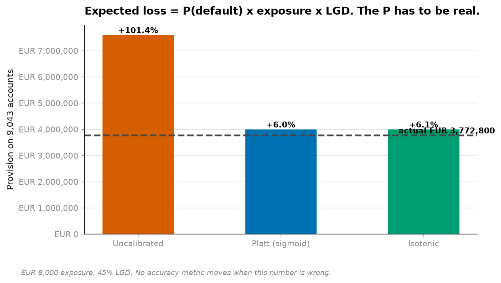
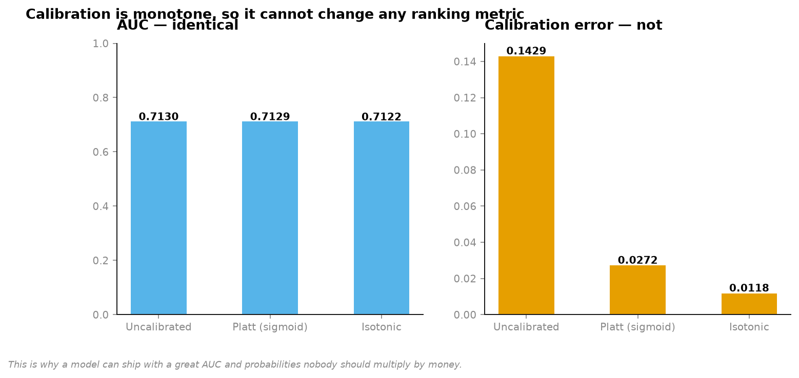
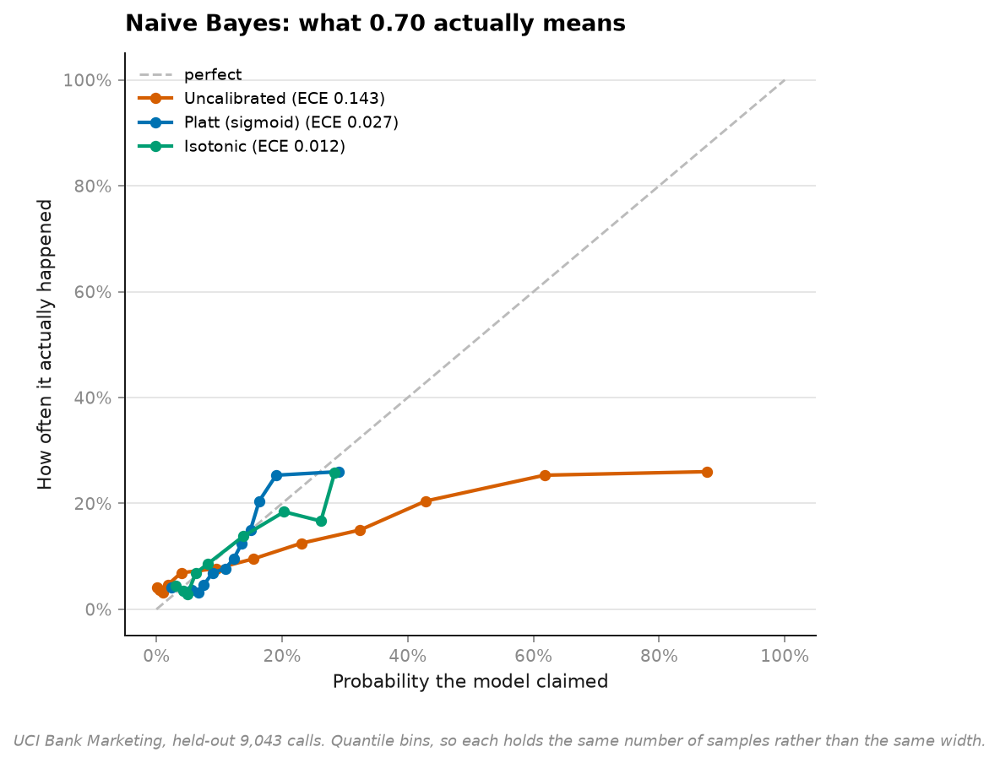
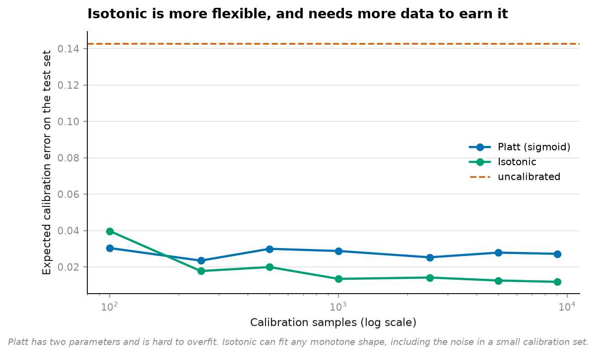

# 12 · Calibration — what 0.70 actually means (NumPy, pandas, Matplotlib, scikit-learn)

**45,211 real phone calls. Four models. One of them would double your loan-loss provision.**

```
at EUR 8,000 exposure, 45% loss given default, on 9,043 held-out accounts

Uncalibrated      provision EUR 7,600,164     +101.45%
Platt (sigmoid)   provision EUR 4,001,054       +6.05%
Isotonic          provision EUR 4,001,764       +6.07%
                  actual     EUR 3,774,000
```



**AUC moved by 0.0000 between those three rows.**

---

## Why AUC cannot see it

AUC depends only on the **order** of the scores. Square them, halve them, take logs — the
ranking is identical and so is the AUC, while every probability has changed.



```
method              AUC       Brier       ECE    worst bin
Uncalibrated     0.7130     0.14817    0.1429       0.6160
Platt            0.7129     0.09831    0.0272       0.0628
Isotonic         0.7122     0.09623    0.0118       0.0951
```

Calibration is a **monotone** transformation, so it *cannot* change any ranking metric.
That is not a limitation of the method — it is the proof that AUC and calibration measure
different things, and that reporting only the first tells you nothing about the second.

One bin of the uncalibrated model was **62 percentage points out**.

## Why it matters the moment you multiply

```
expected loss  = P(default) × exposure × LGD
expected value = P(convert) × margin − cost of contact
reserve        = P(claim)   × severity
```

Every one of those multiplies a probability by money. **A ranking cannot be multiplied.**
The moment a score stops being used to sort and starts being used to size, calibration
stops being optional — and nothing in the standard classification report mentions it.

## Which models are miscalibrated

```
model                    AUC     Brier      ECE    probabilities are
Gradient boosting     0.8067   0.08054   0.0147    about right
Random forest         0.8061   0.08140   0.0146    about right
Naive Bayes           0.7130   0.14817   0.1429    too high
Logistic regression   0.7253   0.09381   0.0139    about right
```



Naive Bayes is catastrophically overconfident, and that is exactly what theory predicts:
it multiplies probabilities under an independence assumption that is false, so correlated
evidence gets counted several times and the posterior is driven toward 0 and 1.

**An honest note on the expected result.** I expected gradient boosting to be visibly
overconfident too — it is the standard example. Here it is not: ECE 0.0147, essentially as
good as logistic regression. With 27,000 training rows and a 250-iteration limit it simply
has not been pushed far enough to sharpen. The textbook effect is real and this run did not
reproduce it, which is reported rather than smoothed over.

## Platt or isotonic?



```
Isotonic beats Platt from about 250 calibration samples on.
```

**Platt** fits a two-parameter sigmoid. Almost impossible to overfit; can only apply a
sigmoid-shaped correction.

**Isotonic** fits any non-decreasing step function. Far more flexible — and with a small
calibration set it fits the noise, scoring beautifully on the data it was fitted to and
worse than nothing on new data.

The crossover is the decision, and it is dataset-specific. Measuring it takes four lines.

## The split that makes this honest

```
train 27,126  |  calibration 9,042  |  test 9,043
```

Three splits, not two. Isotonic regression can reproduce any training set exactly if given
enough steps, so fitted and judged on the same data it reports an ECE near zero whether or
not it has learned anything. **Calibration needs its own held-out set exactly as a model
does**, and a two-way split silently makes the comparison meaningless.

Quantile bins throughout, not uniform ones. On a skewed score distribution — which is every
real classifier — uniform bins leave the top bin holding nine samples and the bottom holding
nine thousand, and the plot ends up dominated by noise at exactly the end that matters.

## Running it

```bash
uv run python projects/12-calibration/run.py
```

Reuses the cached UCI Bank Marketing data from [project 05](../05-leakage/). Around 30
seconds.

**`duration` is dropped** — it does not exist at decision time. That is
[project 05](../05-leakage/)'s finding, applied.

## Problems hit while building this

**The residual 6% error is not a failure, and it is worth saying which part is which.**
Both calibrators land at +6% rather than 0%. Calibration fixes the *shape* of the mapping
from score to probability; it cannot fix a base-rate shift between the calibration split
and the test split. Those two random slices differ slightly in positive rate, and 6% is
roughly that difference. Chasing it to zero would mean fitting the test set.

**The headline number is sensitive to the exposure assumption, and that is a feature.**
EUR 8,000 and 45% LGD are stated at the top of `run.py` as constants, not buried. Change
them and the absolute figures move; the +101% does not, because it is a property of the
probabilities rather than of the money.

## References

The statistical method this project implements and tests against real data comes from:

- Platt, J. (1999). "Probabilistic Outputs for Support Vector Machines and Comparisons to Regularized Likelihood Methods." *Advances in Large Margin Classifiers*, MIT Press.
- Zadrozny, B. and Elkan, C. (2002). "Transforming Classifier Scores into Accurate Multiclass Probability Estimates." *Proceedings of ACM SIGKDD*.
