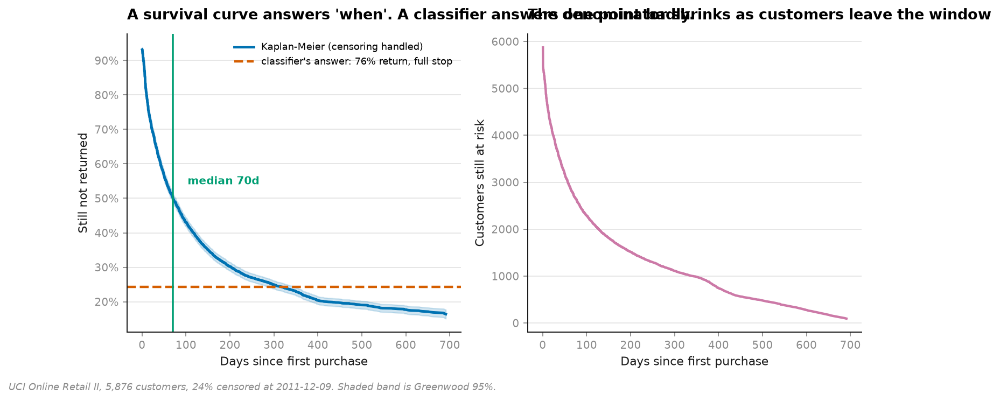
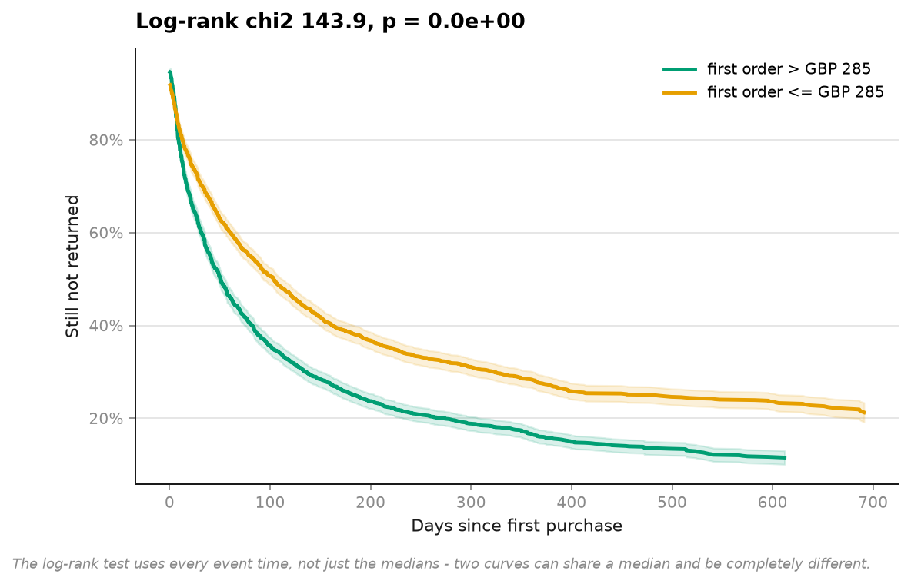
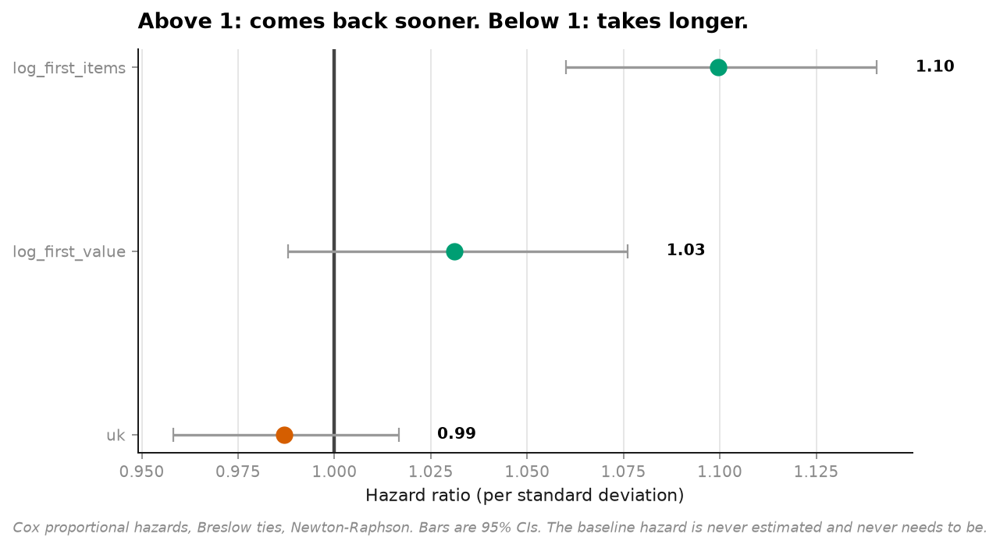
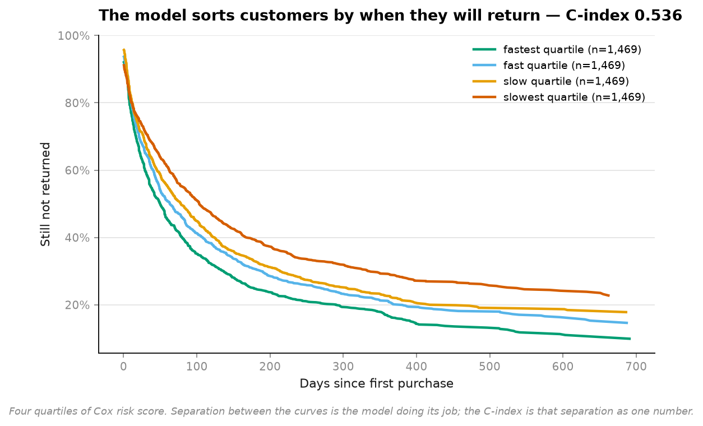

# 13 · Survival analysis — the customers you must not call negatives

**5,876 real customers. Time from first purchase to second.**

```
counting censored customers as "did not return"   75.6% return
Kaplan-Meier at 180 days                          68.1% returned
Kaplan-Meier at 365 days                          77.9% returned

median time to repeat purchase                    70 days
```

A classifier gives you one number and no timeline. Survival analysis gives you the curve —
and, more importantly, handles the customers who simply **hadn't come back yet when the
data ended**.



---

## The error the whole field exists to prevent

"Will this customer churn?" invites a classifier, a cut-off date, and a label. It also
invites this:

> **A customer who has not churned yet is not a negative.**

She is **censored**. All you know is that she hadn't gone by the time you stopped looking.
Label her 0 and you've told the model that eighteen months of loyalty and eighteen days of
it are the same outcome — and every estimate afterwards is biased toward optimism, because
the people most likely to churn soon are still being counted as retained.

Every customer contributes exactly what's known about them:

```
observed    bought again after 34 days        ->  event at t=34
censored    no second purchase, 200 days      ->  survived AT LEAST 200 days
```

The Kaplan-Meier handling of this is almost invisible in the code, which is the point: a
censored customer stays in the at-risk denominator right up to the moment she leaves, then
quietly drops out. Never counted as an event, never counted as a survivor past the point
where she stopped being observed.

## Does the first order predict the second?



```
first order > GBP 285     median  51 days
first order <= GBP 285    median 103 days

log-rank chi2 143.89, p < 1e-30
```

**Customers who spend more first come back twice as fast.** The log-rank test uses every
event time rather than just the medians — two curves can share a median and be completely
different, and comparing medians would miss it.

## Cox proportional hazards



```
covariate            hazard ratio          95% CI           p
log_first_items            1.0996   [1.060, 1.141]    4.02e-07
log_first_value            1.0312   [0.988, 1.076]    1.59e-01
uk                         0.9870   [0.958, 1.017]    3.86e-01

concordance (C-index): 0.5358      (0.5 = chance)
```

`exp(coefficient)` is a **hazard ratio**: 1.10 means 10% more likely to return in any given
interval, among those who haven't yet.

The trick that makes Cox work is that the baseline hazard **cancels out of the partial
likelihood entirely**. The model never has to say what the underlying risk of returning in
week six is — only that this customer's risk is 1.1× that one's, whatever it is.



**C-index 0.536 is weak, and that is the finding.** Basket *breadth* (number of distinct
items) predicts return timing; basket *value* does not, once breadth is controlled for. What
someone spent on day one tells you very little about when they'll be back. Reported rather
than dressed up — a portfolio project that only ever produces strong effects is a portfolio
project that stopped looking.

## A leak that does not look like one

While building this I added `follow_up_days` — how long each customer was observable — as a
covariate. It seemed innocuous. It is not:

```
for censored customers, follow_up_days == duration in 44.1% of rows
```

**For a censored customer, that column *is* the outcome, renamed.** Survival data has its
own leakage mode, and it doesn't look like the usual one.

Then the interesting part:

```
with follow-up (leaky)    C-index 0.5359
without it (honest)       C-index 0.5358
```

**The leak is real and the metric cannot see it.** C-index only scores pairs where at least
one event was observed, and the leaked column carries no information about *those* rows.

That's the same shape as [project 12](../12-calibration/): a genuine defect that the
headline metric is structurally blind to. Both are left in, fitted side by side, because
"the number didn't move" is not evidence that nothing was wrong.

## Implemented directly, not imported

Kaplan-Meier with Greenwood variance, the log-rank test, and Cox by Newton-Raphson on the
Breslow partial likelihood — all in `survival.py`, no `lifelines`.

The censoring logic **is** the lesson. Burying it in a dependency hides exactly the thing
worth understanding.

## Running it

```bash
uv run python projects/13-survival/run.py
```

Reuses the cached retail data from [project 04](../04-customer-value/). Around 40 seconds.

**Data:** UCI Online Retail II, CC BY 4.0.

## Honest limitations

- **"Repeat purchase" is not churn.** It is a proxy with a clean event definition. Real churn
  has no event — you infer it from absence, which is harder and needs a different setup.
- **The window is 24 months.** Anything slower than that is invisible, and `median_survival`
  returns `inf` rather than the last observed time when the curve never reaches 0.5. That is
  the honest answer and the most common way survival results get overstated.
- **Proportional hazards is assumed, not tested.** Cox assumes hazard ratios are constant
  over time. A Schoenfeld residual test would check it; it isn't here, and that is a gap
  rather than a decision.
