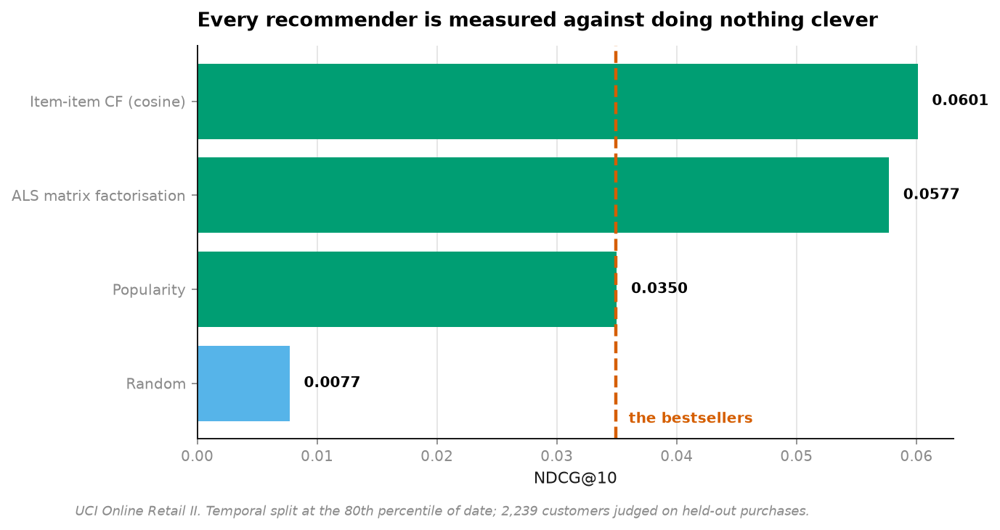
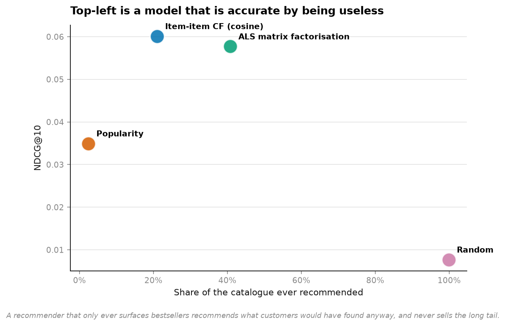
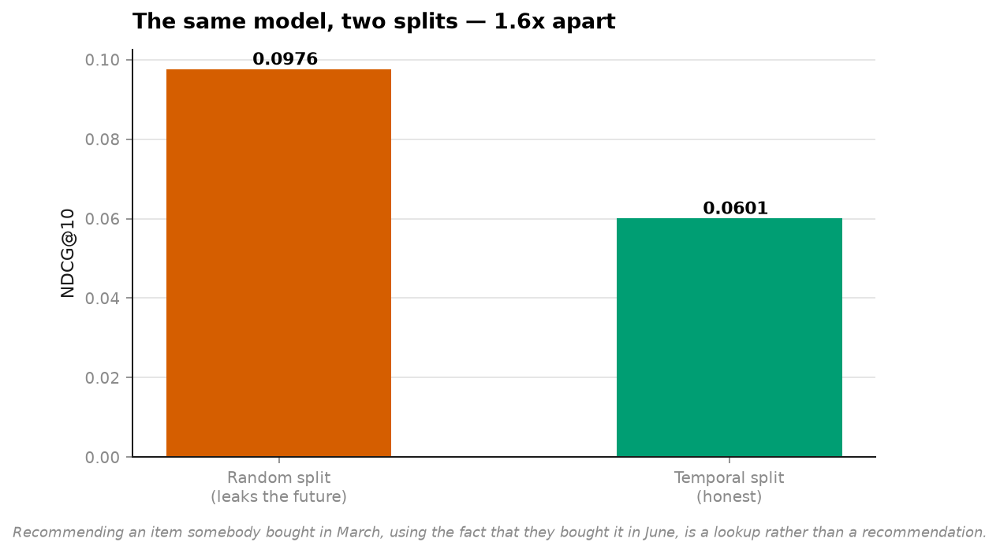
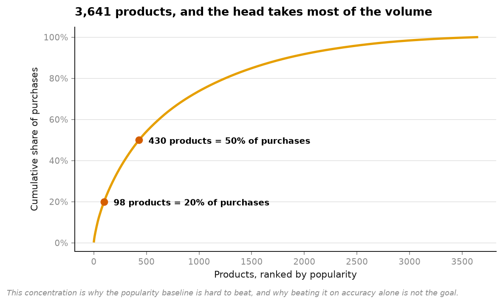

# 14 · Recommenders — the baseline nobody wants to run (NumPy, pandas, Matplotlib)

**1M real transactions. 5,016 customers × 3,641 products. 3.3% of the matrix observed.**

```
model                       prec@10   recall@10   ndcg@10   coverage   novelty
Random                       0.0075      0.0018    0.0077     99.92%     12.95
Popularity                   0.0320      0.0098    0.0350      2.42%      8.22
Item-item CF (cosine)        0.0557      0.0189    0.0601     21.01%      8.90
ALS matrix factorisation     0.0540      0.0196    0.0577     40.84%     10.11
```



Every recommender paper compares one matrix factorisation to another. The comparison
nobody runs is **recommend the bestsellers to everybody** — no model, no training, no
embeddings.

Here the models do clear it: item-item CF by **+72%**. That's a real result, and it is only
meaningful because the baseline was measured rather than assumed.

---

## The number that changes the decision

**Popularity recommends 2.42% of the catalogue.** Eighty-eight products, to five thousand
customers, forever.



```
Item-item CF   ndcg 0.0601   coverage 21.0%   novelty  8.90
ALS            ndcg 0.0577   coverage 40.8%   novelty 10.11
```

ALS scores 4% lower on accuracy and surfaces **twice as much of the catalogue**. For a
wholesaler with 3,641 products, that is not a tie — it is the difference between a
recommender that sells the long tail and one that recommends what customers would have
found anyway.

This is why coverage and novelty sit next to accuracy in the table rather than in an
appendix. A model can be accurate *by being useless*.

## Three things that quietly break offline evaluation

### 1. The split must be temporal



```
random split (leaks the future)   ndcg 0.0976
temporal split (honest)           ndcg 0.0601      1.62x inflation
```

Recommending an item somebody bought in March, using the fact that they bought it in June,
is a lookup rather than a recommendation. **The same model, two splits, 62% apart.** A single date cuts train from test — not a
per-user "leave the last item out", which still lets the model see *other* users' futures.
On co-occurrence methods that is a genuine leak: items A and B look related because next
month they were bought together.

### 2. Implicit feedback is not a rating

A purchase is evidence of interest. A **non**-purchase is not evidence of disinterest — it
is mostly evidence the customer never saw the item. ALS handles this properly: unobserved
cells get target 0 with *low confidence* ("probably not, but we never asked") rather than
being dropped or treated as certain negatives.

### 3. Popularity is a confound, not a feature

Two obscure items bought by the same three people are far stronger evidence than two
bestsellers sharing three thousand buyers. Raw co-occurrence ranks the second pair higher;
cosine normalisation ranks the first. That normalisation *is* the method.

## Why the baseline is so hard to beat



A small head of products takes most of the volume. That concentration is exactly why
"recommend the bestsellers" scores respectably — and exactly why beating it *on accuracy
alone* is the wrong target.

## Running it

```bash
uv run python projects/14-recommenders/run.py
```

Reuses the cached retail data from [project 04](../04-customer-value/). Around three
minutes — ALS fits 12 alternating passes over a 5,016 × 3,641 matrix in pure numpy.

**Data:** UCI Online Retail II, CC BY 4.0. *(MovieLens was the obvious choice and
`files.grouplens.org` refused connections from this machine — verified, not assumed. Real
purchase data is arguably the better test anyway: implicit feedback is the harder and more
common case.)*

## Honest limitations

- **Dense matrices.** 5,016 × 3,641 fits in memory; a real catalogue needs `scipy.sparse`
  and an approximate-nearest-neighbour index. The algorithms are unchanged, the
  implementation would not survive a million items.
- **Filtered to users with 5+ purchases and items with 10+ buyers.** Stated because it
  changes every number — a filtered catalogue makes *every* recommender look better,
  including the baseline.
- **Offline metrics only.** The gap between offline NDCG and online behaviour is the
  central unsolved problem in this field. Nothing here measures whether a recommendation
  would actually be clicked, and no offline benchmark can.
- **No cold start.** New users and new items are excluded rather than handled. That is the
  half of the problem a production system spends most of its time on.

## References

The statistical method this project implements and tests against real data comes from:

- Hu, Y., Koren, Y., Volinsky, C. (2008). "Collaborative Filtering for Implicit Feedback Datasets." *Proceedings of IEEE ICDM*.
- Koren, Y., Bell, R., Volinsky, C. (2009). "Matrix Factorization Techniques for Recommender Systems." *IEEE Computer*, 42(8), 30-37.
