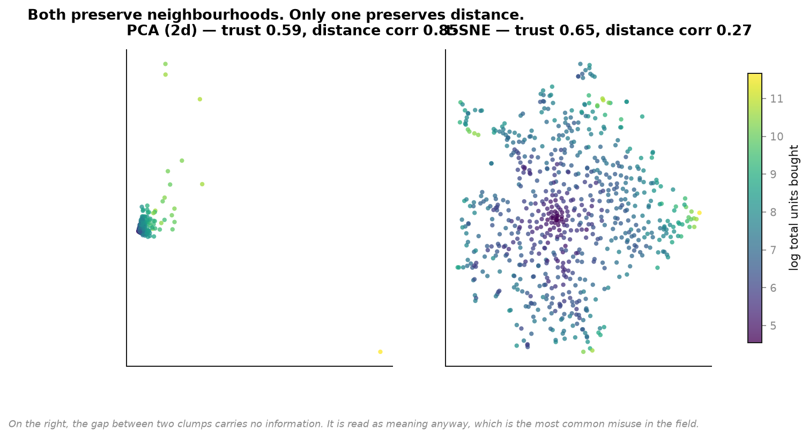
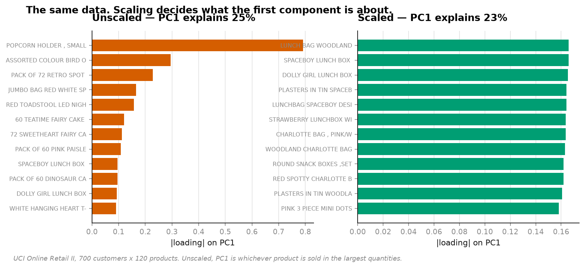
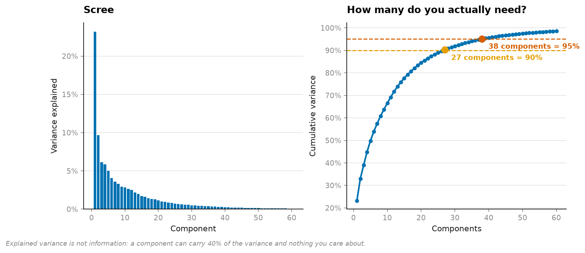
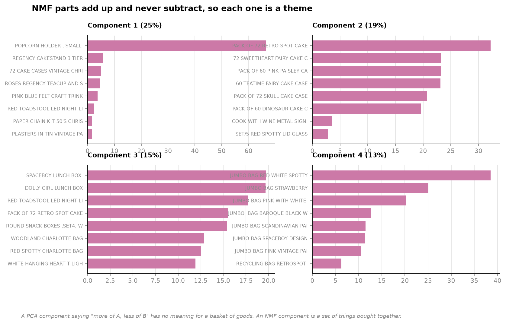

# 15 · Dimensionality reduction — what each method destroys

**700 customers × 120 products. Five reductions of the same matrix.**

```
method              trustworthiness   neighbour overlap   distance correlation
PCA (2d)                     0.5862              0.0568                 0.8471
t-SNE                        0.6478              0.1218                 0.2706
```

**t-SNE preserves neighbourhoods better and destroys global geometry completely.**
Distance correlation 0.27 against PCA's 0.85 — and every t-SNE plot ever published gets
read as though the gaps between clusters mean something.



---

## Three mistakes, in order of how often they're made

### 1. PCA on unscaled data measures your units

```
PCA (unscaled)   PC1 is 16.2% one product: POPCORN HOLDER, SMALL
PCA (scaled)     PC1 is  1.8% one product: LUNCH BAG WOODLAND
```



Variance is not scale-free. Put income in rupees next to age in years and PC1 is income —
not because income matters more, but because rupees are small. Change to lakhs and the
answer changes.

Here, unscaled, the first component is dominated by whichever product ships in the largest
*quantities*. Scaling is not a preprocessing nicety; without it PCA reports your choice of
units back to you.

### 2. t-SNE cluster distances are meaningless

It optimises **local neighbourhoods, explicitly at the cost of global structure**. Two
clusters drawn far apart may be adjacent in the data. Cluster *sizes* are meaningless too —
t-SNE expands sparse regions and compresses dense ones by design.

`distance_correlation` is the number that exposes this, and it's why it sits next to
trustworthiness in the table: the trade is shown rather than asserted.

### 3. Explained variance is not information



```
27 components for 90% of the variance
38 components for 95%     (of 120 products)
```

A component can carry 40% of the variance and nothing you care about — particularly when
one feature is noisy and large.

## NMF: parts that add up



```
method           variance kept   reconstruction MSE
PCA                      60.8%               0.3918
Truncated SVD            87.6%           3951.7742
NMF                     100.0%           4121.4611
```

A PCA component saying *"more of A, less of B"* has no meaning for a basket of goods. NMF
can only **add**, never subtract, and that constraint is the entire source of its
interpretability: each component is a set of things bought together — a theme.

The cost: non-convex, so the answer depends on the seed, and there is no natural ordering
of components by importance. Here they're ordered by reconstruction contribution, which is
a choice, not a property.

**On the MSE column:** the three numbers are not directly comparable, and it would be
misleading to rank them. PCA's error is measured in standardised units; SVD's and NMF's in
raw purchase counts. Same method, different spaces.

## Truncated SVD, and why it isn't just PCA

SVD without centring. Centring a sparse matrix destroys its sparsity — every zero becomes
`−mean` — which on a term-document matrix turns a few million non-zeros into a few billion.
Applied to text, this exact operation is LSA.

## Running it

```bash
uv run python projects/15-dimensionality/run.py
```

Reuses the cached retail data from [project 04](../04-customer-value/). Around two minutes
— trustworthiness is O(n²) in pure numpy.

**Data:** UCI Online Retail II, CC BY 4.0.

## Honest limitations

- **UMAP is named in the module docstring and not implemented.** It needs `umap-learn`,
  which pulls in numba and llvmlite — a large install for one more scatter plot, on a
  connection where several dataset sources have already failed. t-SNE makes the same point
  about local-versus-global.
- **Neighbour overlap is low for both methods** (0.06 and 0.12). 120 dimensions to 2 is a
  brutal reduction and most neighbourhood structure genuinely does not survive it. Reported
  as measured rather than tuned until it looked better.
- **Trustworthiness is O(n²)** and runs on 700 points. It does not scale, and neither does
  the pure-numpy t-SNE input.
