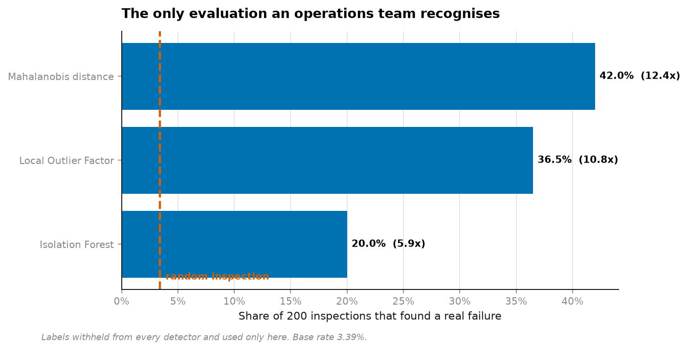
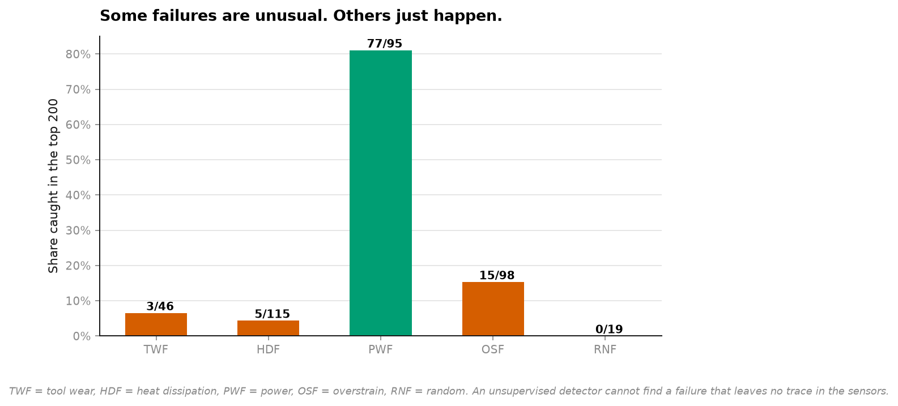
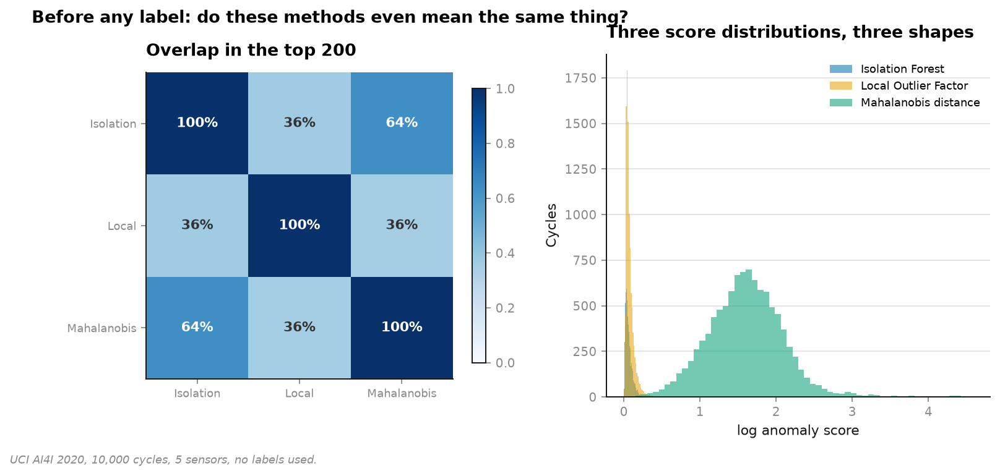
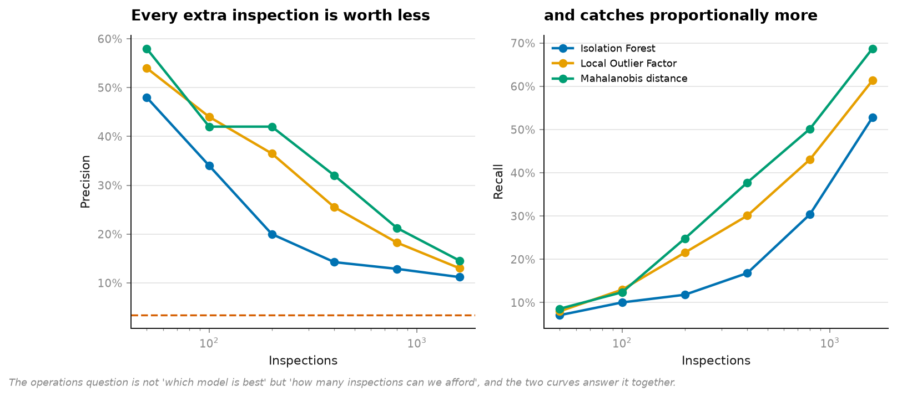

# 16 · Anomaly detection — the question it cannot answer

**10,000 machine cycles, 339 failures. Detectors see five sensors and no labels.**

```
with 200 inspections:        precision   recall    lift   found
Mahalanobis distance            42.00%    24.8%   12.4x      84
Local Outlier Factor            36.50%    21.5%   10.8x      73
Isolation Forest                20.00%    11.8%    5.9x      40
random inspection                3.39%     2.0%    1.0x       6
```



**The simplest method wins.** Mahalanobis distance — one covariance matrix, no
hyperparameters, invented in 1936 — beats Isolation Forest by more than 2×.

---

## The finding that matters more than the leaderboard

```
mode      in data   in top 200   caught
TWF (tool wear)  46          3     6.5%
HDF (heat)      115          5     4.3%
PWF (power)      95         77    81.1%
OSF (overstrain) 98         15    15.3%
RNF (random)     19          0     0.0%
```



**"Anomalous" and "the failure I care about" are different sets.**

Power failures are caught 81% of the time — torque × speed out of range *is* statistically
unusual. Heat-dissipation failures are caught 4% of the time, because a machine failing
from heat looks completely normal in these five readings right up until it doesn't.

No unsupervised method can find a failure that leaves no trace in the sensors. That is not
a tuning problem and no amount of model selection fixes it.

## The structural problem, stated rather than skipped

> **You cannot evaluate unsupervised anomaly detection without labels, and if you had labels
> you would not need it.**

Every paper reporting "AUC 0.94" for an unsupervised detector is evaluating on labels it
claims not to have. That isn't dishonest — it's the only way to measure anything — but it
changes what the number means. It says *"on this dataset, where we know the answer, the
method found it."* Not *"it will find the next one."*

Here the labels are withheld from every detector and used only at the end.

## Before any label: do they agree?



```
Isolation Forest  vs  LOF            overlap 36.5%    rank corr 0.569
Isolation Forest  vs  Mahalanobis    overlap 63.5%    rank corr 0.834
LOF               vs  Mahalanobis    overlap 35.5%    rank corr 0.667
```

Three detectors, three definitions of "unusual", agreeing on barely a third of what they
flag. **Choosing between them is a decision about which definition matters — not a
hyperparameter.**

- **Isolation Forest** — how few random splits isolate this point?
- **LOF** — is this point sparser than its neighbours are? The only one handling *varying*
  density, which is why a global threshold flags entire legitimate operating regimes and
  LOF doesn't.
- **Mahalanobis** — how many standard deviations from the centre, given the covariance?
  Assumes one elliptical blob. Here that assumption happens to be right.

## The budget, which is the real question



An operations team can inspect *k* machines a week. Not "which model is best" but "how many
inspections can we afford, and what does each one buy" — precision and recall answer it
together, and neither answers it alone.

## Running it

```bash
uv run python projects/16-anomaly/run.py
```

Reuses the cached AI4I data from [project 03](../03-imbalanced-maintenance/). Under a minute.

**Data:** UCI AI4I 2020, CC BY 4.0.

## Problems hit while building this

**I expected Isolation Forest to win and it came last.** It is the method everyone reaches
for, and on five well-behaved continuous sensors with a roughly elliptical joint
distribution, a covariance matrix is simply a better description of "normal". The result is
reported as measured — and the general lesson is the specific one: Isolation Forest earns
its reputation on high-dimensional, mixed-type, non-elliptical data, and this is none of
those.

**`contamination=0.05` is a guess, and it is load-bearing for two of the three detectors.**
It is set to roughly 1.5× the true failure rate, which in a genuinely unlabelled setting you
would not know. That parameter is exactly the label information the method claims not to
need, entering through a side door — worth naming, since it is almost never mentioned.
