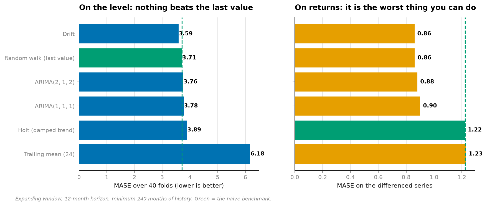
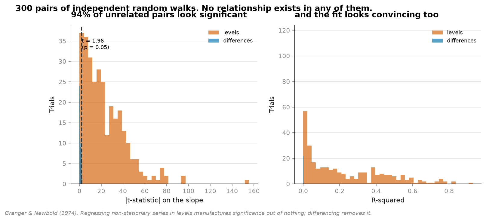
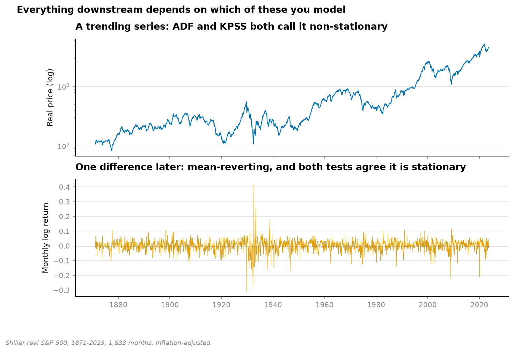
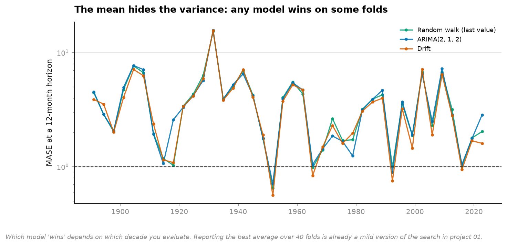

# 17 · Time series — the decision that comes before the model (NumPy, pandas, Matplotlib, statsmodels)

**1,833 months of Shiller's inflation-adjusted S&P 500, 1871 to 2023.**

Before ARIMA, before Holt-Winters, before any model: *is this series stationary?* That one
answer decides what every model afterwards will say, and it is usually made in a single line
of a notebook.

```
                          same models, same data
                 on the level          on the differences
ARIMA(1,1,1)      3.776  worse          0.860   best
Trailing mean     6.176  worst          0.901
Random walk       3.712  benchmark      1.223   worst
Drift             3.587  best           1.230
```



**The ranking inverts completely.** The trailing mean is the worst model on prices by 66%
and among the best on returns. The random walk is unbeatable on prices and last on returns.
Nothing changed but one `np.diff`.

---

## The part that should worry you

Two independent random walks. No relationship. None. Regress one on the other:

```
regressed on      p<0.05    median R²    median |t|    max R²
levels             93.7%       0.162         18.80     0.930
differences         4.0%       0.000          0.72     0.006
```



**94% of unrelated pairs come back significant, with a median t-statistic of 18.8.**

Not marginal. Not p = 0.04. A t-statistic of 18.8 is the kind of number that ends an argument
in a meeting. It is produced here by two series that were generated independently by a random
number generator forty lines earlier.

This is Granger & Newbold (1974), and it is why "we found a strong relationship between X and
Y" is close to meaningless when X and Y both trend. The 4% in the differenced row is the
correct behaviour — a 5% test being wrong about 5% of the time.

## And the test that should settle it, doesn't

```
series                     ADF p    KPSS p    verdict
Real price (level)        1.0000    0.0100    non-stationary
Log real price            0.9577    0.0100    non-stationary
Log return (1st diff)     0.0000    0.1000    stationary
CPI (level)               1.0000    0.0100    non-stationary
CPI inflation (diff)      0.0000    0.0100    UNDECIDED
```

The two tests have **opposite nulls**, which is stated almost nowhere:

- **ADF** — null is *"has a unit root"*. Small p ⟹ stationary.
- **KPSS** — null is *"is stationary"*. Small p ⟹ **not** stationary.

So a confirmed verdict needs both to reject, in opposite directions. US inflation gets
p = 0.0000 from one and p = 0.0100 from the other: ADF says stationary, KPSS says not. Both
at maximum confidence. Both on 150 years of data.

That is not a defect in the data. It is what a series with a slowly-varying mean looks like
to two tests that each assume it away, and it is the single most-argued-about series in
applied macroeconomics for exactly this reason. **The analyst picks one and proceeds.**



## The fold-level view, which the averages hide



Forty expanding-window origins, 12-month horizon. Every model wins on some folds. Choosing
the model with the best *average* MASE over 40 folds is already a mild version of the
overfitting measured in [project 01](../01-backtest-overfitting/) — one selection from six
candidates on one path of history.

## Running it

```bash
uv run python projects/17-time-series/run.py
```

About two minutes — most of it refitting ARIMA on 80 folds.

**Data:** Shiller S&P 500 monthly (Yale), public.

## Problems hit while building this

**ARIMA(1,1,1) wins on the differenced series, which means it is over-differenced.** The
series is already returns; `d=1` differences it again. Over-differencing normally inflates
variance and hurts — here it wins, because the MA(1) term absorbs exactly the artefact the
extra difference introduces (a differenced white noise is an MA(1)). The model is
compensating for its own misspecification and landing in a good place. Reported as measured,
but it is not evidence that `d=1` was right — it is evidence that ARIMA is flexible enough
to undo a bad choice, which is a very different claim.

**Drift beats the random walk by 3.4% on prices, and it is a 155-year-specific result.** It
works because US equities went up over this particular sample. A drift model fitted to
Japanese equities from 1990 would have produced the opposite sign for thirty years. The
number is real; its generality is not, and a 3.4% edge from one path of history is exactly
the kind of finding project 01 exists to discount.

**ARIMA orders are fixed, not searched.** Searching `(p,d,q)` per fold and reporting the best
would inflate every number here. The order is pinned to two common choices and refitted —
the honest version, and the reason ARIMA does not look better than it is.
