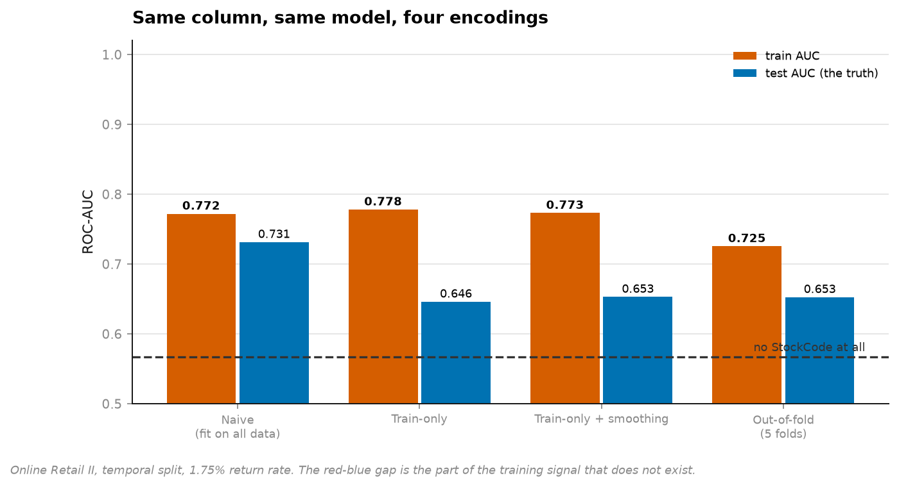
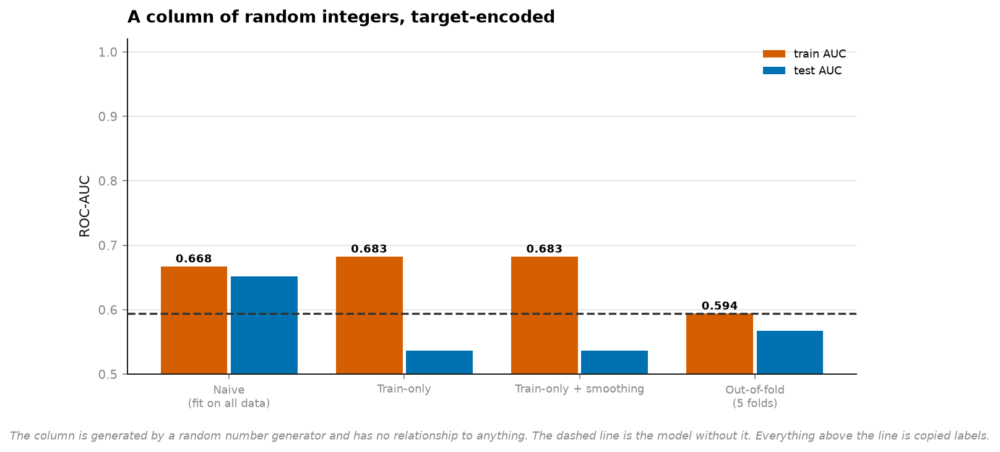
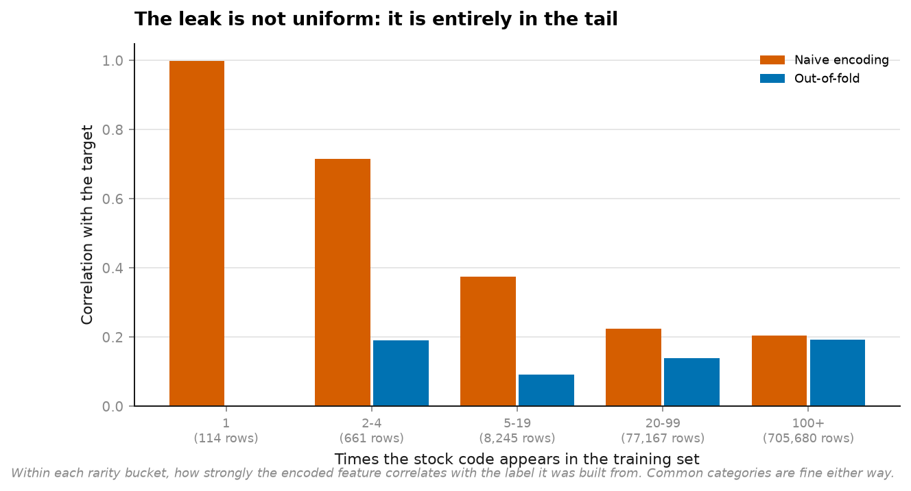
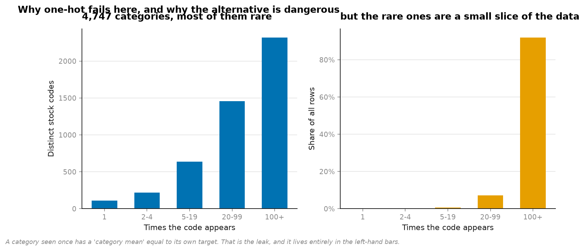

# 18 · Target encoding — the leak inside a single column (NumPy, pandas, Matplotlib, scikit-learn)

**1,055,823 invoice lines, 4,747 stock codes, temporal split.** Predict whether a line is a
return.

```
encoding                   train AUC   test AUC     gap   vs baseline
(no StockCode at all)         0.5943     0.5673  0.0270            -
Naive (fit on all data)       0.7721     0.7314  0.0407      +0.1640
Train-only                    0.7781     0.6461  0.1320      +0.0787
Train-only + smoothing        0.7731     0.6530  0.1201      +0.0857
Out-of-fold (5 folds)         0.7255     0.6526  0.0729      +0.0853
```



**The broken encoder has the best test score.** Not the best training score — the best *test*
score, by 0.08 AUC, which is the margin people publish papers about. Anyone comparing
encodings on a held-out set picks the one that is wrong.

---

## The control that settles it

The same four encoders, run on a column of **random integers**. Generated by
`rng.integers(0, 4747, size=len(frame))`. Related to nothing.

```
encoding                   train AUC   test AUC
Naive (fit on all data)       0.6675     0.6515
Train-only                    0.6827     0.5370
Train-only + smoothing        0.6827     0.5370
Out-of-fold (5 folds)         0.5944     0.5674
```



**A column with zero information improves the test AUC from 0.567 to 0.652.**

That is the whole finding. Every point of that is copied labels. And the out-of-fold row —
0.5674 against a 0.5673 baseline — is what a worthless column is *supposed* to score.

## Why it happens, in one sentence

> **The row you are encoding is inside the mean you are encoding it with.**

For a category appearing 500 times, one row in the average is a rounding error. For a
category appearing **once**, the encoded value *is* that row's target.



```
appearances    naive corr    out-of-fold corr      rows
1                   0.999              -0.000       114
2-4                 0.714               0.192       661
5-19                0.374               0.091     8,245
20-99               0.224               0.139    77,167
100+                0.204               0.193   705,680
```

Correlation between the encoded feature and the label it was built from. **At one
appearance, 0.999 — the feature is the label.** At 100+ appearances the two methods agree,
because the mean has become a real statistic.

The leak is not spread evenly. It lives entirely in the tail, and the tail is exactly where
high-cardinality encoding is most tempting.



## Two things that are less obvious

**Train-only encoding makes the model worse, not just measured more honestly.** Test AUC
0.6461 against out-of-fold's 0.6526. No test target reaches the encoder, so the score is
clean — but every *training* row is still encoded with a mean containing itself, so the model
learns to trust a feature that will be weaker at serving time. The usual "fix" fixes the
measurement and leaves the model broken.

**Smoothing helps but does not solve it.** Shrinking toward the prior recovers +0.007 over
raw train-only, essentially matching out-of-fold here. On the noise column it recovers
nothing at all (0.5370, identical to unsmoothed to four decimals) because with ~167 rows per
random category the shrinkage barely bites. Smoothing addresses *rare* categories; it does
nothing about a row being inside its own mean.

## Running it

```bash
uv run python projects/18-encoding-leakage/run.py
```

Reuses the cached Online Retail II data from [project 04](../04-customer-value/). Under a
minute after the first fetch.

**Data:** UCI Online Retail II, CC BY 4.0.

## Problems hit while building this

**`Quantity` had to be dropped, and it is the obvious feature.** Returns carry negative
quantities, so `Quantity` *is* the label — the [project 05](../05-leakage/) mistake, in a
dataset where it is easier to miss because the column is not called `duration`. The features
are price, month, weekday and hour, which is why the baseline AUC is only 0.57. A weak
baseline is the correct setting for this experiment: it makes the fabricated lift visible.

**The naive encoder beating the correct one on test was not the result I expected.** I built
this expecting the usual shape — inflated training score, honest test score exposing it. The
naive encoder fits on *all* data including test, so the test rows are encoded with their own
targets too. The training/test gap, the diagnostic everyone reaches for, shows 0.0407 for the
broken encoder and 0.0729 for the correct one. **The diagnostic points the wrong way.** A
small train-test gap is evidence of nothing when the leak crosses the split.

**The split is temporal, not random.** A random split on transaction data would let the model
see a stock code's future return rate, which is a second leak on top of the one being
measured. The cut is at 75% of the time axis.

## References

The statistical method this project implements and tests against real data comes from:

- Micci-Barreca, D. (2001). "A Preprocessing Scheme for High-Cardinality Categorical Attributes in Classification and Prediction Problems." *ACM SIGKDD Explorations*, 3(1), 27-32. (target/mean encoding)
- See also Kaufman et al. (2012) cited in [project 05](../05-leakage/README.md) — the same leakage principle, one column instead of one feature.
