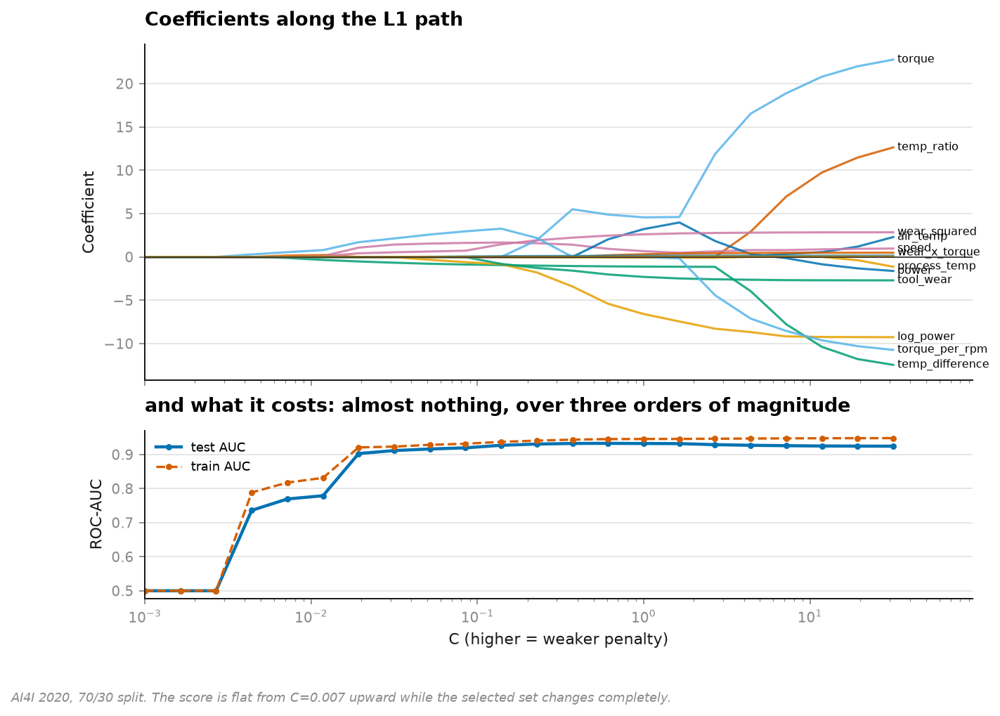
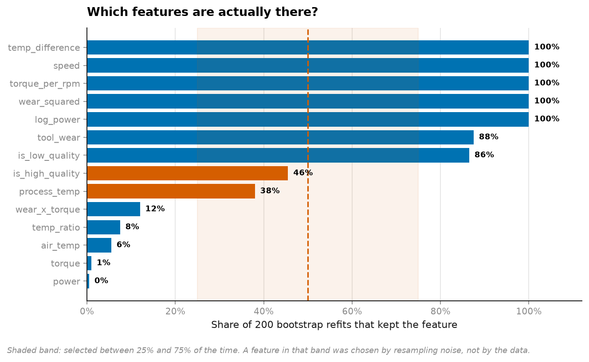
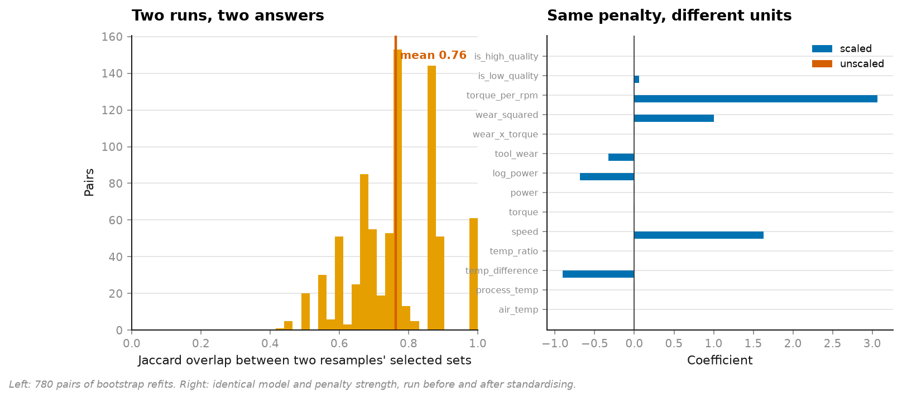
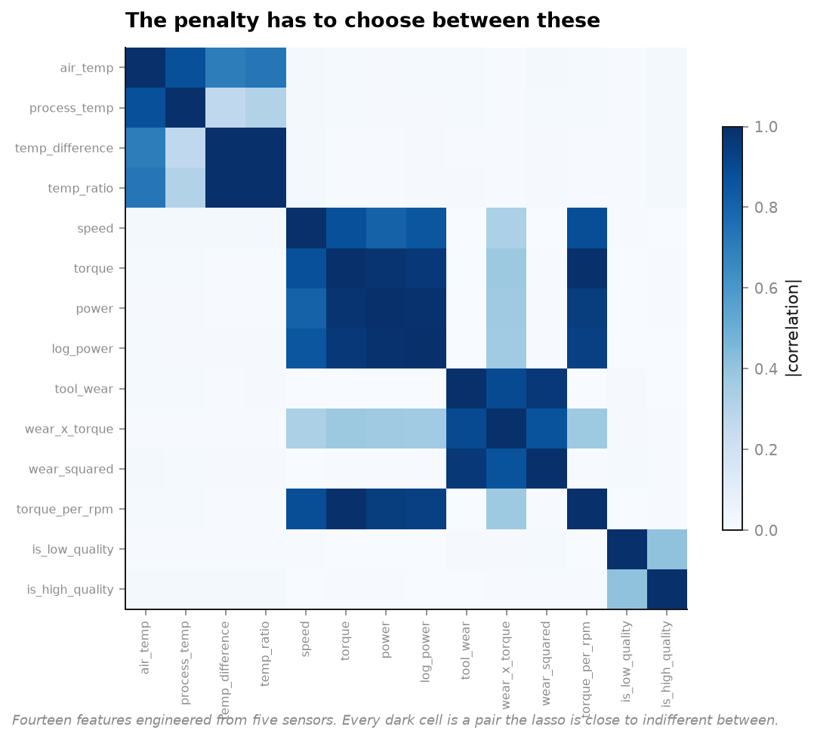

# 19 · Regularisation — "the model selected these features" is not a finding (NumPy, pandas, Matplotlib, scikit-learn)

**10,000 machine cycles, 14 features engineered from 5 sensors, 3.39% failure rate.**

```
model                  train AUC   test AUC   features kept
Ridge (L2)                0.9347     0.9216        14 / 14
Lasso (L1)                0.9342     0.9229         7 / 14
Elastic net (0.5)         0.9352     0.9238        10 / 14
No penalty                0.9482     0.9239        14 / 14
```

**Test AUC spread across all four: 0.0023.** The lasso throws away half the features and
scores within a quarter of a point of the model that keeps every one.



The score is flat across three orders of magnitude of penalty strength while the selected set
changes completely. **Which means the test score cannot tell you which selection was right.**

---

## The part that is actually alarming

The lasso's 200-bootstrap selection frequencies, next to how correlated each feature is with
the one the lasso dropped:

```
kept                  selected        dropped              selected     |r|
log_power               100.0%   <->  power                    0.5%   0.988
torque_per_rpm          100.0%   <->  torque                   1.0%   0.993
temp_difference         100.0%   <->  temp_ratio               7.5%   0.999
```



**`temp_difference` survives 100% of bootstraps. `temp_ratio`, which correlates with it at
0.999, survives 7.5%.** These two features carry the same information to three decimal places.
One is reported as essential and the other as noise.

And the standard diagnostic — bootstrap and check stability — **says both results are solid**.
It has to: the tie is broken by a property of the full dataset, so every resample breaks it
the same way. Resampling cannot re-flip a coin that has already landed.

> Reproducible is not the same as meaningful. A 100% selection rate proves the choice was
> *consistent*, not that it was *about the data*.

The genuine instabilities it does catch are real and worth having — `is_high_quality` at 45.5%
selection and only 71.4% sign agreement is a variable nobody should be quoting a direction
for. But the diagnostic's silence on the correlated pairs is the more important result.



Mean Jaccard overlap between the sets chosen on different resamples: **0.76** (min 0.42).
Two analysts resampling the same data agree on roughly three quarters of the selected set.

## The mistake that costs 0.12 AUC

```
             features kept    test AUC
scaled                   7      0.9229
unscaled                12      0.7984
```

Six features in common. `torque_per_rpm` survives only when scaled; `air_temp`, `power`,
`process_temp`, `temp_ratio`, `torque` and `wear_x_torque` survive only when unscaled.

The penalty is applied to **coefficients**, and coefficients carry the units of their
features. Tool wear is in minutes, temperature in kelvin, power in watts. An unscaled L1
penalty therefore selects variables in proportion to how large the numbers happen to be — and
`power`, whose values run to thousands, keeps a coefficient simply because shrinking it costs
more per unit of fit.

This is not an exotic failure. `StandardScaler` is one line, it is easy to omit inside a
pipeline that did not need it before, and nothing errors.

## Why these features are correlated



```
temp_difference    temp_ratio        |r| = 0.999
torque             torque_per_rpm    |r| = 0.993
power              log_power         |r| = 0.988
torque             power             |r| = 0.979
tool_wear          wear_squared      |r| = 0.966
```

Nothing here is contrived. Power *is* torque × angular velocity. Heat dissipation depends on
the temperature *difference*. A maintenance engineer building features would build exactly
these, and the result is a design matrix where the penalty is choosing between near-duplicates
— which is the situation nearly every real feature set is in.

## Running it

```bash
uv run python projects/19-regularisation/run.py
```

About four minutes; 240 `saga` fits for the bootstrap. Reuses the cached AI4I data from
[project 03](../03-imbalanced-maintenance/).

**Data:** UCI AI4I 2020, CC BY 4.0.

## Problems hit while building this

**I wrote this expecting the selection to be unstable, and it mostly wasn't.** The plan was
the textbook demonstration: bootstrap, watch the lasso swap between correlated features, show
that the explanation is noise. It swapped on two features out of fourteen. Rather than tune
the setup until it produced the expected picture, the finding is reported as it came out — and
it is the more interesting result, because *consistency* is precisely what practitioners cite
as evidence that a selection is real. The 100%-vs-7.5% split between two features correlated
at 0.999 says more than instability would have.

**`C_CHOSEN = 0.1` is not the best penalty.** The path's best test AUC is 0.9327 at C = 0.61
with 11 features. The stability experiments are run at C = 0.1 because that is where the lasso
is doing visible selection (7 of 14) — at the optimum it barely penalises anything and there
is nothing to measure. Choosing the operating point for the experiment rather than for the
score is stated rather than hidden; the reported test AUCs are all at C = 0.1 and are
correspondingly ~0.01 below the achievable best.

**The split is by row order, not shuffled.** AI4I is a simulated sequence and row order is
production order. It changes little here (the process is stationary by construction), but a
shuffled split on machine data is the [project 05](../05-leakage/) mistake and the habit is
worth keeping.

## References

The statistical method this project implements and tests against real data comes from:

- Hoerl, A.E. and Kennard, R.W. (1970). "Ridge Regression: Biased Estimation for Nonorthogonal Problems." *Technometrics*, 12(1), 55-67.
- Tibshirani, R. (1996). "Regression Shrinkage and Selection via the Lasso." *Journal of the Royal Statistical Society, Series B*, 58(1), 267-288.
- Zou, H. and Hastie, T. (2005). "Regularization and Variable Selection via the Elastic Net." *Journal of the Royal Statistical Society, Series B*, 67(2), 301-320.
