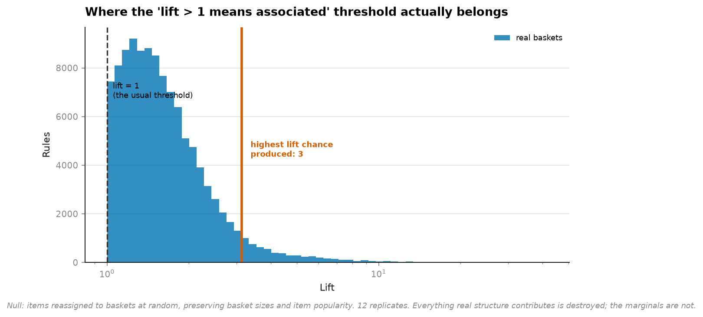
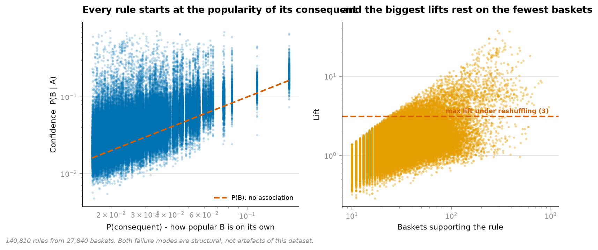
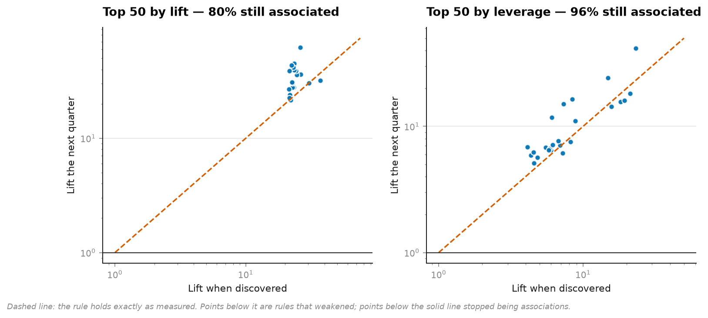
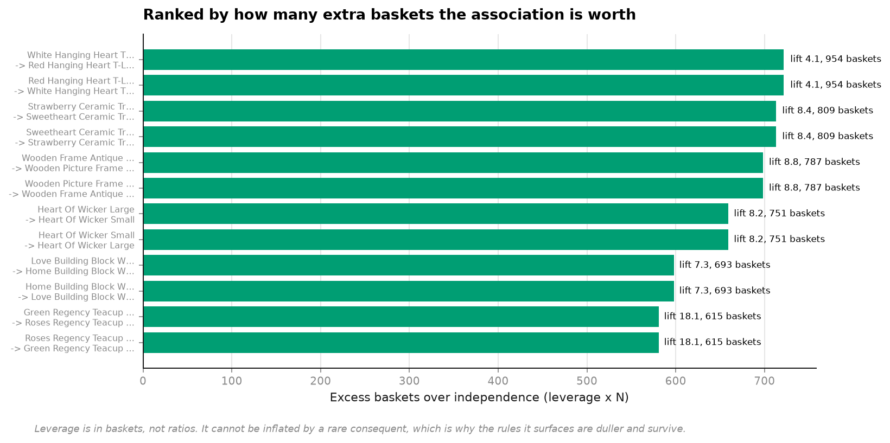

# 20 · Market basket — what a shuffled shop looks like

**27,840 multi-item invoices from a UK gift wholesaler, 4,934 products, 140,810 rules.**

```
                        real baskets    items reshuffled at random
rules found                  140,810                       151,847
median lift                      1.4                           1.4
99th percentile lift             5.8                           2.1
max lift                        38.0                           3.1
share with lift > 2            18.3%                          2.4%
```



**79% of rules have lift above 1** — the threshold every tutorial uses for "associated".
Reshuffle the products across baskets, destroying every real association while keeping basket
sizes and product popularity intact, and **chance still produces a maximum lift of 3.1**.

Only 4.3% of the real rules clear that line. Everything below it is indistinguishable from a
shop where the items were assigned at random.

---

## Failure one: confidence is popularity wearing a hat

```
rule                                              conf    lift    P(B)
Red Hanging Heart T-Light  -> White Hanging Heart  67.3%    4.1   16.4%
Painted Metal Pears        -> Assorted Bird Orn.   70.4%    9.2    7.6%
Poppy's Playhouse Bedroom  -> Poppy's Kitchen      73.3%   37.2    2.0%
```

If B appears in 16% of all baskets, every rule ending in B starts at 16% confidence before A
contributes anything at all. The mean P(consequent) among the top-confidence rules is **5.01%
against 2.88% across all rules** — confidence is ranking, in part, by how popular the
right-hand side is.



The left panel is the whole problem: confidence never drops below the popularity of its own
consequent.

## Failure two: lift, once you remove the guardrails

Bounded to the top 400 products with 10+ co-occurrences, the lift ranking is fine — the top
rules rest on a median of **296 baskets** and are genuinely real (pink/blue/red versions of
the same mini dots cup, the two Poppy's Playhouse rooms).

Drop the support floor to 3 and widen to 2,500 products — closer to what the tooling does by
default — and there are **1,260,380 rules**:

```
rule                                            lift   baskets   conf
French Blue Metal Door Sign N  -> ... Sign N    310.9        45  69.2%
French Blue Metal Door Sign N  -> ... Sign N    306.5        43  68.3%
French Blue Metal Door Sign N  -> ... Sign N    292.3        43  66.2%
```

A lift of **311×**, computed from 45 baskets out of 27,840. Every one of the top six rules is
one numbered door sign predicting another numbered door sign — a handful of shops stocking a
complete set. It is the highest-ranked "discovery" in the dataset and it is one buying habit.

## The only test that matters

Rules discovered before 2011-07-24, re-measured on the 8,473 baskets after it:

```
top 50 ranked by...              still have lift > 1
lift (top 400 products)                       80%
leverage (top 400 products)                   96%
lift (unbounded, support >= 3)                32%
```



**Two thirds of the unbounded top-50 stop being associations entirely.** The bounded rules
hold up well — which is the honest finding here, and it means the support floor is doing
almost all of the work that the metric gets credit for.

## What to rank by instead



**Leverage** — how many *more baskets* contain both items than independence predicts — is in
baskets, not ratios. It cannot be inflated by a rare consequent, because a rare consequent
cannot produce many excess baskets by definition. It holds up best across quarters (96%), and
the rules it surfaces are duller and larger.

That is the trade the whole field gets backwards: lift rewards *surprise*, and surprise on
transaction data is mostly small denominators.

## Running it

```bash
uv run python projects/20-market-basket/run.py
```

About six minutes — the permutation null refits 12 complete rule sets. Reuses the cached
Online Retail II data from [project 04](../04-customer-value/).

**Data:** UCI Online Retail II, CC BY 4.0.

## Problems hit while building this

**The rare-item failure mode did not appear, and I had written the conclusion first.** The
draft asserted that the top-lift rules would rest on four or five baskets. They rested on 296,
because `top_items=400` and `min_support_count=10` had already excluded every rule that would
have proved the point. Rather than present the guardrails as the result, the unbounded rule set
was added alongside — and the contrast (296 baskets vs 43, 80% holding vs 32%) is a better
finding than the one I was aiming at. **The parameters, not the metric, were doing the work.**

**Enormous baskets had to be capped.** A wholesale order with 200 distinct lines contributes
19,900 pairs on its own and would dominate the co-occurrence counts. `max_basket=60` is a
judgement call, so it is an explicit parameter rather than a silent filter.

**Quantity is ignored, deliberately.** Buying three of something is a quantity question, not
an association question. Baskets are sets; counting a repeated item twice inflates every pair
it appears in.

**140,810 rules from 159,600 candidates is a multiple-comparisons problem nobody names.** At
any fixed significance threshold, thousands clear it by chance — the same arithmetic as
[project 01](../01-backtest-overfitting/), in a field whose standard tooling has no notion of
it. The permutation null is the correction, and it is not in any of the popular libraries.
